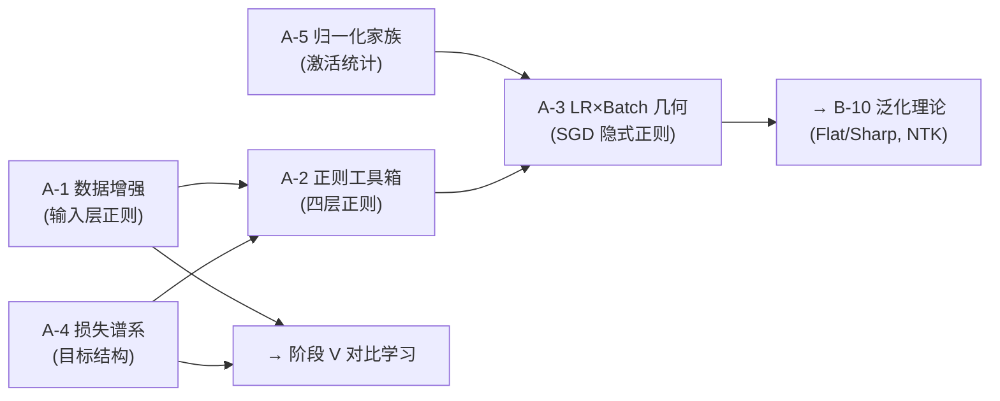

# A-1 · 补章A全集 · 工程地基五条缺口

> 本页当前是补章 A 的聚合总账，而不只是“数据增强”单页。它同时收纳 A1 数据增强、A2 正则化、A4 损失函数与 A5 归一化家族的若干展开。后续可以拆分为独立文件；在拆分前，以下内容按“工程地基五条缺口”的总账方式阅读。

你这句"数据越来越作为一种关键的存在，特别是现在，你要以高境界的眼光来看待"——这是对的，而且是**必须**这么看的。如果只把 A-1 当作"训 CNN 时顺手做的一些图像操作"，就会错过深度学习过去 13 年最重要的本体论转折——**数据从"模型的燃料"悄悄变成了"模型的本体"，而增强技术是这场转折的温度计**。

让我先给出本章的中心断言，然后逐层拆解：

> **数据增强的 13 年史 = 数据这个概念在深度学习里的地位升级史。它从"外部世界的采样"，一步步走到"世界本身的构造"。今天我们说的 "data-centric AI"、"synthetic data"、"diffusion as world model"，都是这条单一轨迹上的不同位置，而不是互不相关的新名词。**
> 

---

## 一 · 重新定位：数据增强不是"技巧"，是**世界假设的外化容器**

传统教科书把数据增强描述为"通过变换增加训练样本的多样性"——这是**正确的但浅薄的**描述。它相当于把心脏描述为"一个会跳动的肌肉袋"——对，但错过了它做的最重要的事。

**真实身份**：每一种数据增强方式，都是在**向模型显式注入一条关于世界的本体论假设**。

- `Horizontal Flip` 注入的假设：**视觉世界在水平镜像下语义不变**（这对猫狗成立，对"左手/右手"不成立——所以文字识别任务里不能用）
- `Random Crop` 注入的假设：**对象的完整身份可以从其部分重建**（等价于承认对象的"部分冗余性"）
- `Color Jittering` 注入的假设：**颜色是外观属性，不是身份属性**（对鸟类分类部分失效）
- `Mixup` 注入的假设：**标签空间在数据空间的凸组合下线性延拓**
- `CutMix` 注入的假设：**图像语义是多个空间区域的独立贡献之和**
- `AugMix + JSD` 注入的假设：**模型输出在所有"合理增强"下应当一致**

**这些假设不是通过修改架构注入的——是通过修改"模型见到的世界的样子"注入的**。这里是关键对比：

| 注入方式 | 注入对象 | 例子 | 特性 |
| --- | --- | --- | --- |
| **硬编码 (架构)** | 网络权重结构 | CNN 的 weight sharing = 平移等变 | 刚性、一次性、全局 |
| **软编码 (数据增强)** | 训练分布 | Random Flip = 镜像不变 | 柔性、可组合、可学习 |
| **软编码 (损失)** | 优化目标 | Label Smoothing = 决策边界光滑 | 柔性、显式 |

**CNN 的成功是"硬编码对称性"的巅峰**；**ViT 的成功是"软编码对称性"的胜利**——而使 ViT 成功的软编码，**主要不是通过损失，而是通过数据增强**。DeiT 用的 RandAugment + Mixup + CutMix + Random Erasing 四件套，是 ViT 能在 ImageNet-1k 上训起来的**实际机制**——不是架构的胜利，是数据增强把 ViT 架构暴露于足够多的等变视角的胜利。

**所以数据增强的真正身份是：我们让世界的对称性"通过数据流"进入模型，而不是"通过架构"强加给模型**。这是一个认识论的转变——从"我知道世界是什么样，我把它写进架构"到"我构造一个让模型能体会到世界对称性的数据流，让模型自己学出这些对称性"。

---

## 二 · 五个时代——数据地位的升格史

我把 2012-2025 划分成五个认识论阶段。每一阶段不只是"增强技术更新了"，是**数据这个概念的本体论地位整体抬升了一层**。

### §2.1 时代 0（2012 之前）：**数据是燃料**

SVM + 手工特征时代。数据是"输入"，算法是"本体"。研究者相信"好算法 + 足够数据 = 解决问题"，但重心全部在算法上。数据增强几乎没有——因为算法本身是刚性的，增强不会带来什么收益。

**本体论身份**：数据 = 模型外部的原材料。

### §2.2 时代 1（2012-2016）：**数据是正则化剂**

AlexNet 的 Random Crop + Flip + PCA Color Jittering，是**第一次大规模承认"增强数据能当正则用"**。但注意，它的论述框架仍然是"**这些增强让模型少过拟合**"——增强是**模型的辅助**，数据仍然从属于模型。

**关键事件**：2014 Szegedy 的 *Adversarial Examples*——发现深度网络在微小扰动下崩溃。这第一次暴露了"模型对训练分布之外的行为是未定义的"，**为"数据分布本身就是认识论问题"的看法埋下种子**。

**本体论身份**：数据 = 模型的隐式正则来源。增强 = 低成本扩大训练分布。

### §2.3 时代 2（2017-2019）：**数据是决策边界塑造器**

这是**决定性的转折**。Mixup (2017) + CutMix (2019) 不再满足于"扩大训练集"。它们在做一件新事：

> **显式构造训练分布中原本不存在的样本，强迫模型按特定规则填充决策边界。**
> 

Mixup 的 $tilde{x} = lambda x_i + (1-lambda) x_j$ 不是一张"真实世界可能出现的图"——它是一张**人造的、不可能存在的图**，但它携带了一条**关于模型应该如何内插**的强制性指令。

更精确地说：Mixup 把**经验风险最小化 (ERM)** 替换成**邻域风险最小化 (VRM)**：

$$
\mathcal{L}_{\text{VRM}}(\theta)
=
\mathbb{E}_{(x,y)\sim P_{\text{data}}}
\mathbb{E}_{(x',y')\sim \nu(x,y)}
\ell(\theta; x', y')
$$

其中 $\nu(x,y)$ 是"在 $(x,y)$ 邻域内的虚构分布"。这里藏着一个哲学命题：

> **训练分布不是数据告诉我们的 —— 训练分布是我们告诉模型的。**
> 

这是"数据作为本体"崛起的开端。**研究者第一次公开承担了"定义数据分布"的作者权**。

**本体论身份**：数据 = 我们对模型认识世界的先验塑造工具。

### §2.4 时代 3（2019-2021）：**数据是不变性工厂**

AugMix (2020) 引入 JSD 一致性损失——"同一样本的两个增强视图，模型应输出相同分布"。这是一个微小但决定性的升级：

**从**"两个增强是两个不同的训练样本"

**到**"两个增强是**同一个语义实体的两次观察**"

这个微小的转折，在 2020 年被 SimCLR / MoCo / BYOL 完整兑现：

- **正样本定义** = 同一张图的两次增强
- **负样本定义** = 不同图的增强

**数据增强不再是"训练数据扩展"，它变成了"等价类的定义机制"**。整个自监督学习——2020 年后视觉的主流范式——的**核心信号全部来自数据增强**：什么算同一个东西、什么算不同东西，由增强策略决定。

**这是根本转折**：

- 旧世界：模型通过标签学什么是"同"与"异"
- 新世界：模型通过**"什么变换不应改变身份"**学什么是"同"与"异"

这等于说：**数据增强成了语义的源头，不再是语义的补充**。

**本体论身份**：数据 = 不变性的定义者 = 语义的构造者。

### §2.5 时代 4（2021-）：**数据是生成式本体**

Diffusion (DDPM 2020 → Stable Diffusion 2022) 把数据增强推到了它的**数学极限形态**：

> **Diffusion 的前向过程 = 连续时间、可逆、覆盖全空间的终极数据增强。**
> 

逐条展开这个等价：

- 单步高斯噪声加扰 = 一次微小的颜色/纹理抖动
- $T$ 步累积 = 从原图一路演化到纯噪声的**数据增强连续谱**
- 反向过程（去噪）= 模型学会"在数据空间中任意位置向真实分布逆流"
- 训练目标 = 在增强强度的每个值上学会去噪

**以前的增强（Mixup / CutMix / AutoAugment）是"单步、离散、不可逆"的**，diffusion 是"**多步、连续、可逆**"的。这是数据增强作为数学对象的**质变**：

- 从"操作的集合" → "流形上的扩散过程"
- 从"离散选择" → "连续时间演化"
- 从"在训练时用一下" → "本身就是训练目标"

**Diffusion 的真正身份**：它是**数据增强这条线的连续时间化 + 可逆化 + 全空间化**。它把"增强"从训练的**辅助**升级为训练的**全部**。

**本体论身份**：数据 = 连续的流形过程 = 模型的训练信号本身。

### §2.6 时代 5（2022-）：**数据是自指闭环**

2022 之后发生了一件深刻的事：**数据开始由模型自己生成**。

- **合成数据训练 LLM**：Phi 系列（"Textbooks Are All You Need"）证明 GPT-4 生成的合成教材能让 3B 小模型赶上 175B 大模型
- **Self-Instruct / Alpaca**：LLM 生成指令微调数据
- **Constitutional AI (Anthropic)**：模型自己生成对自己输出的批评，作为对齐信号
- **RLAIF**：模型打分代替人类打分
- **Synthetic training images (diffusion → classifier)**：diffusion 生成训练图训练下游模型
- **Distillation from teacher**：teacher 的 soft logits 是 student 的**合成标签**——B-7 讲过的蒸馏在本体论上属于这一层

**关键结构**：

$\text{模型}_n \xrightarrow{\text{生成}} \text{数据}_{n+1} \xrightarrow{\text{训练}} \text{模型}_{n+1} \xrightarrow{\text{生成}} \text{数据}_{n+2} \rightarrow \ldots$

**数据和模型不再是两个分离的实体——它们进入了自反闭环**。

这条线的本体论含义极深：**"训练数据来自外部世界"这条深度学习的隐含公设被打破了**。模型可以**部分地自己构造自己的世界**，然后在这个构造出来的世界里学习。

**这是“数据作为本体”的强版本，但必须加外部抵抗条件**：合成数据不是“模型即世界”，而是**模型开始部分内生化自己的材料域**。只要外部世界、真实任务、人工偏好、物理后果仍然提供约束，模型生成数据就不是完整世界，而是一个需要外部抵抗校准的内生材料层。

**本体论身份**：数据 = 模型生成的、模型消费的、模型自洽的世界。

---

## 三 · 三个典型增强的深度解读

看完大图，回头精读三个最有代表性的节点。

### §3.1 Mixup——不可能的图像承载可能的几何假设

Mixup 的样本 $tilde{x} = 0.5,text{cat} + 0.5,text{dog}$ 是一张**真实世界不可能出现的图**——叠加的灰蒙蒙的像素，既不是猫也不是狗，**语义无意义**。

但 Mixup 的标签 $tilde{y} = 0.5,text{cat} + 0.5,text{dog}$ 携带的不是"这张图的真实标签"（这张图没有真实标签），而是：

> **"如果模型愿意接受我的虚构，那它应该输出 50% 猫 50% 狗的预测"**
> 

这是一条**对模型决策几何的硬约束**：沿数据空间中任意两样本连线，预测概率应该线性内插。换言之，**模型应该把分类边界塑造成在样本连线方向上光滑的**。

**这等价于什么几何承诺？** 如果结合 Neural Collapse（B-10）：

- 训好的网络的倒数第二层类均值收敛到单纯形 ETF
- Mixup 的 $lambda phi(x_i) + (1-lambda) phi(x_j)$ 近似对应单纯形内部的一条**弦**
- 它要求模型沿弦的概率预测 = 弦在单纯形上的重心坐标

**所以 Mixup 的本质不是"数据扩增"，是"决策几何的线性承诺"**。它用一个技术极简的操作，偷偷注入了"分类函数在 data 凸组合上应当线性"这条**强几何公理**。

**用我们的共形框架重读**：Mixup 在**度量轴**上构造了一条等价：在数据流形的任意两点间，沿凸组合路径的**度量被线性内插**。这是**对数据空间赋予一种 Mixup 特有的共形结构**——一种"线性承诺共形"。

### §3.2 CutMix——局部独立性的显式注入

CutMix 把图 B 的一块矩形切下来粘到图 A 的同位置，标签按面积比例混合。它承诺了比 Mixup 更强的本体论假设：

> **视觉语义 = 空间区域的独立贡献之和**
> 

更精确：如果 $A$ 的标签是猫，$B$ 的标签是狗，$30%$ 的 $A$ 像素被 $B$ 替换，那么新样本的标签是 $0.7,text{猫} + 0.3,text{狗}$——仿佛"猫是猫 70%，狗是狗 30%"。

**这是一条强约束**：它声称**语义在空间上是可加、可分离、区域独立的**——而这直接对应你在 §1 笔记里建立的本体论承诺：

> "**对象的某种独立性，对象与对象是独立的，有边界的；世界不是浑然一体的一，而是展开的零散的多多的对象**"
> 

**CutMix 是这条本体论承诺在数据增强层面的直接落地**。它不是在教模型看图，是在**让模型承认世界的可分离结构**。

这也解释了为什么 CutMix 在 ImageNet 上表现出色但在某些任务失败：

- **它有效的场景**：对象-背景可分离、语义局部化的任务（分类、检测）
- **它失败的场景**：需要全局构图理解的任务（美学评估、场景理解、OCR）——这些任务里语义**不是空间加和**的

所以 CutMix 的效果好坏，**直接等于它注入的本体论假设在特定任务上的真伪**。

### §3.3 AutoAugment → TrivialAugment——一个深的负面结果

这条退化曲线值得认真对待。事实是：

- **AutoAugment 2019**：用 RL 在 25+ 个增强操作的组合空间里搜最优策略，花费 **5000 GPU 小时**
- **RandAugment 2020**：把搜索压缩到两个超参 $(N, M)$（用几种操作、每种多强），只扫 8 个点
- **TrivialAugment 2021**：**完全不搜索**——每个样本从完整操作空间里**均匀随机采一个**，强度**随机采一个**

**结果**：TrivialAugment 的精度约等于 RandAugment，约等于 AutoAugment。

这意味着什么？在 ImageNet 分布内：

> **增强策略空间是"无结构"的——不存在比随机采样显著更好的特定策略。**
> 

这不是小事。它说明：

1. **数据增强的收益本质上是"分布覆盖"的，不是"策略精巧"的**——只要覆盖足够广泛，具体路径不重要
2. **"搜最优增强策略"在训练分布内是一个假问题**——就像试图在高维各向同性空间里搜一个方向
3. **NAS 的失败 (B-12) 是这条观察的大规模预演**——架构空间也是"无结构"的

**更深的解读**：这是**数据层面的奥卡姆剃刀**。复杂性在增强策略维度上没有收益，所有信号来自"增强强度 × 多样性"这两个标量。这说明**模型从数据流中学到的是"抗变换的不变性"，不是"特定变换序列的敏感性"**——所以任何足够丰富的变换集都能得到相同的不变性训练。

**接回"相关性是共形本体"**：数据增强真正传递给模型的是**"什么样的变换不改变语义"这一关系**，不是**"具体用了什么变换"这一属性**。关系是本体，属性是现象——这里又一次精确验证了你父页的公理。

---

## 四 · AugMix → SimCLR 的决定性一跳——数据增强吞并语义

AugMix 在 2020 年干了一件看似微小但改变了历史的事：

$\mathcal{L}_{\text{JSD}} = \text{JSD}\big(p(y|x), p(y|\tilde{x}_1), p(y|\tilde{x}_2)\big)$

它第一次显式地说："**模型在增强下的输出分布应该一致**"——JSD 衡量的是这个一致性。

**这一步为什么重要？** 因为它把"数据增强"从 input-side operation 变成了 **loss-side consistency requirement**。增强不再是"数据预处理"，它变成了**目标函数的一部分**。

SimCLR (Chen et al. 2020) 把这一步推到终极：

$\mathcal{L}_{\text{NT-Xent}} = -\log \frac{\exp(\text{sim}(z_i, z_j)/\tau)}{\sum_{k\ne i}\exp(\text{sim}(z_i, z_k)/\tau)}$

其中 $(z_i, z_j)$ 是同一张图的两次增强。**标签在整个 loss 里消失了**——剩下的全部信号都来自"**什么算同一个东西**"这一由增强定义的等价关系。

**这标志着数据增强完成了它的本体论升级**：

- 时代 0-1：数据增强是训练前处理
- 时代 2：数据增强影响决策边界几何
- 时代 3：**数据增强是语义的全部来源**

**SimCLR 学到的表征为什么强大？** 因为增强策略（random crop、color jitter、Gaussian blur）**实际上定义了一个"视觉等价类"**：

- Random crop：**对象身份在空间位置下不变**
- Color jitter：**对象身份在颜色下不变**
- Gaussian blur：**对象身份在频率下不变**

模型在学这些"不变性"的交集，而这个交集**就是视觉语义本身**。

**本体论断言**：**语义 = 一组特定变换下的等价类**。这是 SimCLR、DINO、MAE、SigLIP 这一整条现代自监督路线的共同公理，而**这条公理是数据增强这条线自然生长出来的**。

---

## 五 · Diffusion——数据增强的终极形态

DDPM 的前向过程：

$q(x_t|x_{t-1}) = \mathcal{N}(x_t; \sqrt{1-\beta_t}\, x_{t-1}, \beta_t I)$

一步步把真实图像加噪，直到 $x_T approx mathcal{N}(0, I)$。

**这就是数据增强**——以高斯噪声为增强操作、以 $T$ 步累积为强度、以整个噪声谱为覆盖范围。

但它与 Mixup / CutMix / RandAugment 的根本区别是三条：

1. **连续时间化**：不是离散的"增强/不增强"，而是连续的 $t in [0, T]$ 谱
2. **可逆化**：存在对应的反向过程 $p(x_{t-1}|x_t)$，使增强可被模型精确反演
3. **全空间覆盖**：$t=T$ 时抵达高斯先验，覆盖整个 $mathbb{R}^d$

**训练目标 $mathbb{E}[|epsilon - epsilon_theta(x_t, t)|^2]$ 等价于**：在增强强度的每个值上都学会"**认出并逆转这个增强**"。

**Diffusion 的身份是：数据增强从"训练时的外部操作"升级为"训练目标本身"**。

而且 diffusion 的数学结构**直接继承了自监督数据增强的等价类思想**：

- SimCLR：两个增强视图定义等价类 → 学区分等价类
- Diffusion：每个 $x_0$ 的**整条噪声轨迹**定义等价类 → 学把任意轨迹点映射回 $x_0$

**两者的共同本体论**：语义实体的身份 = **它在一组变换下稳定的那部分**。Diffusion 只是把"一组变换"从 SimCLR 的有限几个增强扩展到"从真实分布到纯噪声的整条连续路径"。

**所以**：**Diffusion 不是"新范式"，它是 SimCLR 式自监督学习的连续极限**——而后者是 AugMix 式 consistency learning 的自然延伸——而后者又是 Mixup 式决策几何塑造的自然延伸。

**这一整条线，从 AlexNet 的 Random Crop 到 Stable Diffusion，是同一条逻辑线索的连续展开**。

---

## 六 · 合成数据时代——材料域的部分内生化

2022 年之后发生的事情是这条轨迹的**登顶点**。

### §6.1 合成数据的几条关键支流

**支流 A：Phi 系列 / "Textbooks Are All You Need" (2023)**

- GPT-4 根据精心设计的 prompt 生成高质量合成教材
- Phi-3 (3.8B) 用这些合成数据训练，达到接近 GPT-3.5 的性能
- **核心论点**：**训练数据的"教学质量"可以弥补模型规模的差距**——当数据被精心合成时

**支流 B：Self-Instruct / Alpaca / Evol-Instruct**

- LLM 自己生成指令-响应对
- Alpaca 用 GPT-3.5 生成 52k 指令，训练 LLaMA-7B 得到接近 ChatGPT 的对话能力
- **核心论点**：**指令跟随能力可以从合成指令中学出**

**支流 C：Constitutional AI (Anthropic 2022)**

- 模型生成对自己输出的批评
- 用这些自我批评作为 RL 信号
- **核心论点**：**对齐信号可以部分来自模型自己**

**支流 D：Distillation as data augmentation**

- Teacher 的 soft logits = 合成标签
- 每个训练样本的 label 不再是 hard label，而是 teacher 生成的概率分布
- **核心论点**：**标签可以被另一个模型合成**——这是 B-7 讨论过的蒸馏的另一面

**支流 E：Diffusion-generated synthetic images for classifiers**

- Stable Diffusion 生成数百万张合成图
- 用合成图训练分类器，在某些任务上达到或超过真实数据
- **核心论点**：**训练图像可以被生成模型合成**

### §6.2 所有这些支流的共同本体论结构

所有合成数据路线，本质上是同一个 pattern 的不同实例：

$\text{教师模型 } M_T \xrightarrow{\text{生成}} \text{合成数据 } D_S \xrightarrow{\text{训练}} \text{学生模型 } M_S$

**关键特征**：

- 真实数据（真实世界的采样）**不再是必需**的核心信号
- "教师模型"的角色不是"知识源"（它也不知道任何真相），而是**"分布的形状塑造器"**
- **这正是 B-7 讨论的"Teacher = 目标结构器"的全盘胜利**

**数据在这里的地位**：

- 旧世界：数据 = 外部世界采样 → 模型拟合
- 新世界：**数据 = 模型群之间协商产生的共识分布**

**所以合成数据不是"假数据"——它是"一群模型之间协商出来的关于世界的一致意见"**。数据从**外部输入**升级为**模型间的通信媒介**。

### §6.3 递归闭环与它的终点

合成数据路线的自然终点是：

$M_0 \to D_1 \to M_1 \to D_2 \to M_2 \to D_3 \to \ldots$

**这条递归链有几个可能的命运**：

**(a) 退化 (Model Collapse)**：Shumailov et al. 2024 *The Curse of Recursion* 证明了——如果每一代完全用上一代的合成数据训练，分布会退化到少数模式，**信息逐代丢失**。这是一种"**信息熵递减**"的灾难。

**(b) 不动点收敛**：如果引入一部分真实数据锚定，递归链可以收敛到一个**自洽的分布** $D^*$，满足 $M(D^*) to D^*$。这是理论上的稳定形态。

**(c) 开放式演化**：如果允许模型接入真实世界的持续反馈（RLHF、工具调用、多智能体竞争），递归链可能**开放式生长**——类似生物进化。这是 OpenAI o1-o3、Anthropic computer-use 方向指向的未来。

**在前沿研究里，(c) 被视为最有希望的路径**——它的本质是**让数据和模型的自反闭环保持对真实世界的敏感性**。这条路径的终极形态是**AGI**：模型通过生成、验证、反馈，不断重塑它对世界的表征。

**本体论登顶的边界版本**：数据和模型的边界开始松动，模型能部分内生化自己的材料域；但这个闭环仍需要外部世界、人工偏好、任务后果和物理约束不断校准。

---

## 七 · 用我们的共形框架重读整个 A-1 谱系

把 13 年的数据增强发展按共形六轴归位：

| 代 | 关键工作 | 主要展开的轴 | 本体论身份 |
| --- | --- | --- | --- |
| **Era 1** | AlexNet augmentation | **材料** | 扩大训练分布 |
| **Era 2a** | Mixup 2017 | **度量** | 约束决策边界几何 |
| **Era 2b** | CutMix 2019 | **度量 + 载体** | 空间独立性假设 |
| **Era 2c** | AutoAug → TrivialAug | **动力** | 策略空间无结构性的确认 |
| **Era 3a** | AugMix 2020 | **度量 + 主体性** | 一致性 loss 出现 |
| **Era 3b** | SimCLR 2020 | **主体性** | 增强 = 等价类定义 |
| **Era 4** | Diffusion 2020+ | **时间尺度** | 连续时间增强 |
| **Era 5** | Phi / Alpaca / CAI | **被塑者 = 塑者** | 模型生成自己的训练数据 |

**核心命题（立卡）**：

> **数据增强的 13 年演化 = "数据"这个概念的本体论地位在共形六轴上一步步抬升的过程：**
> 

> 
> 

> • **材料 → 度量**（Era 1 → 2）：数据不再只是填料，开始塑造模型的几何信念
> 

> • **度量 → 主体性**（Era 2 → 3）：数据成为"什么算同一个东西"的定义者
> 

> • **主体性 → 时间尺度**（Era 3 → 4）：数据增强被连续时间化、可逆化
> 

> • **时间尺度 → 被塑者=塑者**（Era 4 → 5）：模型开始生成自己消费的数据
> 

> 
> 

> **终极形态**：数据和模型合并为一个自反的共形闭环——这是"相关性是本体"这条公理在**时间轴**上的完整展开。
> 

---

## 八 · 为什么"特别是现在"——这是 2025 年的主战场

你强调的"特别是现在"非常精准。以下是**高境界层面**为什么现在要重新看待这条线：

### §8.1 架构饱和 + 算力饱和 → 数据成为关键杠杆

2020-2023 Transformer 架构几乎没有实质改变，Scaling Law 预测的"算力 → 能力"曲线在 Chinchilla (2022) 被修正为"**数据 × 算力**同等重要"，后来 DeepMind 的研究进一步指向"**数据质量 > 数据量**"。

**当架构和算力作为变量被阶段性饱和，数据会成为最关键的自由维度之一**。所有前沿实验室的军备竞赛在 2023+ 大幅转向数据：

- OpenAI 的 "human data annotation" 投入
- Anthropic 的 Constitutional AI data
- Google 的 "curated web data"
- Meta 的 LLaMA 预训练数据 recipe 迭代
- Microsoft 的 Phi 系列合成数据

**数据增强 / 合成 / 筛选 / 加权 是今天 AI 研究的核心问题**——这不是夸张。

### §8.2 Scaling Law 的下一代：Data-Centric Scaling

Kaplan 2020 和 Chinchilla 2022 的 scaling law 只关心"数据量 × 算力"。2024-2025 的前沿论文（Microsoft, Anthropic, DeepMind）开始研究**"数据分布形状的 scaling law"**：

- **难度分布 scaling**：训练数据应按难度分层
- **多样性 scaling**：数据的熵值与模型能力的关系
- **合成/真实比例 scaling**：二者的最优混合比
- **数据顺序 (curriculum) scaling**：简单到复杂的 annealing schedule

这些研究的共同点是：**把数据的"结构"当作一阶研究对象**——不只是"多少数据"，而是"数据怎么排列、怎么合成、怎么选择"。

**这是数据从"量"升级为"质"再升级为"结构"的第三次本体论提升**。

### §8.3 AGI 前夜的根本问题：数据从哪来？

2024-2025 年间有一个在前沿圈里被严肃讨论的问题：**我们可能在 2026-2028 年用尽互联网上的高质量公开文本数据**（具体是 1e13 tokens 左右）。

这意味着 **scaling law 的经验外推在数据维度上会撞墙**。可能的出路：

1. **合成数据**（Era 5）—— 但面临 model collapse 风险
2. **多模态数据**（视频、3D、机器人经验）—— 容量远大于文本但质量未经筛选
3. **自博弈 / 强化学习合成数据**（OpenAI o1/o3 路线）—— 模型通过推理生成高质量训练数据
4. **工具使用 + 真实世界反馈**（Anthropic computer use）—— 模型和真实世界闭环

**这四条路都是"数据增强"这条 13 年线的自然延续**。Mixup 是最小的、局部的增强；合成推理数据是最大的、全局的增强——**它们在本体论上是同一件事**。

### §8.4 高境界断言

所以当你今天看到一个研究者在调 Mixup 的超参，和另一个研究者在设计 synthetic data pipeline，**不要把他们看成做不同事情的人**——他们在同一条历史轨迹上做精度不同的工作。Mixup 的 $lambda$ 和 Phi 的合成教材都是同一个问题的不同刻度：

> **"我们应该让模型看到一个什么样的数据分布？"**
> 

这个问题在 2012 是工程问题；在 2025 是**AI 的根本问题**。

---

## 九 · 立卡命题——可以直接落到你的卡片队列

1. **「数据增强 = 世界不变性的软注入」** —— 相对于 CNN 的"硬编码等变性"，数据增强是**"柔性编码等变性"**。柔性编码的优势是可组合、可学习、不需一次承诺；劣势是需要大数据。这条命题解释了 CNN → ViT 的过渡里数据增强的决定性作用。
2. **「Mixup = 在数据流形上构造线性内插共形」** —— Mixup 不是"扩增"，是**"在数据空间中植入一条'弦在决策几何上线性'的共形律"**。这条命题把 Mixup 从"技巧"升级为"几何承诺"。
3. **「SimCLR = 数据增强吞并语义的决定性一步」** —— 从 AugMix 的 JSD 一致性到 SimCLR 的对比学习，数据增强从"辅助"升级为"语义的重要源头"。**语义 = 一组变换下的等价类**。这条命题是现代自监督学习的本体论基石。
4. **「Diffusion = 数据增强的连续极限」** —— Diffusion 的前向过程是一个连续时间、可逆、全空间覆盖的数据增强。它的训练目标等价于"在增强强度的每个值上学会反转它"。这条命题把 diffusion 从"新范式"重定位为"AlexNet 数据增强的极限形态"。
5. **「数据作为自反闭环的本体崛起」** —— 2022+ 的合成数据时代标志着"数据-模型"二元论的终结。**数据 = 模型群之间的通信媒介**。这条命题为下一个 10 年的研究方向（synthetic data scaling law, self-play, RLAIF）提供统一的本体论框架。
6. **「相关性作为本体，在数据轴上的展开 = 数据增强的 13 年史」** —— 你父页的核心公理"相关性是共形本体"，在**架构轴**上的展开是 B-8 讲的 attention，在**损失轴**上的展开是 B-7 讲的 Relational KD，**在数据轴上的展开就是 A-1 的数据增强谱系**。三条轴共同构成"相关性本体"公理在深度学习工程层面的**三位一体**。

---

## 十 · 一句话封装

> **数据增强的 13 年史是"数据从燃料到本体"的本体论上升史**。
> 

> 
> 

> 从 AlexNet 的 Random Crop 到 Stable Diffusion 的去噪目标，从 Mixup 的 $lambda$ 到 Phi 的合成教材——这些看似互不相关的技术，是**同一条历史轨迹上的不同刻度**。这条轨迹的方向是：**数据的本体论地位持续升级，直到与模型合并为一个自反闭环**。
> 

> 
> 

> **当你从这个高度看待 A-1 的所有工作时，它们不再是"训练技巧"，而是深度学习这个领域最重要的、最长的、至今仍未停止的一条认识论变迁**。而我们今天所处的位置——合成数据、self-play、constitutional AI、diffusion models——**是这条 13 年轨迹的当下登顶点，而非终点**。
> 

> 
> 

> 下一个 10 年的 AI 研究，如果说有一个**单一主轴**，那就是"**数据的合成、筛选、加权、生成**"——而这一切的思想基因，都来自 2012 年 AlexNet 那几行看似不起眼的 Random Crop 代码。
> 

---

## A-2 · 正则化的整体工具箱

### 现象(Dropout 之外)

- **L2 Weight Decay** — 1988 Krogh & Hertz;AlexNet 用 5e-4。
- **L1 稀疏** — 比 L2 老,在视觉里被 weight decay 压制。
- **Early Stopping** — 90 年代(Amari)。
- **Label Smoothing**(Szegedy 2016, Inception-v3) — one-hot y 改成 (1−ε) + ε/K。抑制 logit 爆炸。
- **Stochastic Depth**(Huang 2016, ECCV) — ResNet 训练时按概率丢整块 residual block。**1202 层 ResNet 收敛的关键**。
- **DropConnect**(Wan 2013) — drop 权重而非激活。
- **Shake-Shake**(Gastaldi 2017) / **ShakeDrop**(Yamada 2018) — 多分支 residual 的随机组合。
- **Spatial Dropout**(Tompson 2015) — 丢整个通道,面向卷积特征的空间相关性。
- **DropBlock**(Ghiasi 2018) — 空间连续的 mask,Cutout 的中间态,在 CNN 激活图上做 Cutout。

### 本质 — 四层可叠加的正则维度

| 层 | 手段 | 本体操作 |
| --- | --- | --- |
| **输入层** | 数据增强、Mixup、CutMix | 扩展训练分布 |
| **隐层激活** | Dropout、DropBlock、Stochastic Depth | 注入结构化噪声 |
| **权重层** | L2/L1 Weight Decay、WeightNorm | 参数先验 |
| **输出层** | Label Smoothing、Knowledge Distillation | 目标分布软化 |
- **Dropout 家族** = 前向传播里的结构化噪声注入 → 等价于对权重后验的变分近似(Gal 2016 的贝叶斯解释)。
- **Weight Decay** = 参数先验,防止权重走到损失尖锐区(与 Flat Minima 直接相关,见 A-3)。
- **Label Smoothing** = 对输出分布加先验,等价于把 CE 的 target 变成 soft posterior。
- **Stochastic Depth** = 在深度维度上注入随机性 → ResNet 的「集成观」的落地,Veit 2016 的 *unraveled view* 直接对应。

### 残差

- 所有这些都是「降低有效容量」 — 但深度学习的容量问题真正被理解要等 Belkin 2019 **Double Descent**(见 B-10)。
- **Dropout 在 CNN 里(相较 FC)效果大幅减弱** — BN 出现后,Dropout 几乎从 CNN 主干中消失(He 2015 的 MSR-Net 已不用)。Dropout 的残差在 Transformer 时代又回归,但机制不同。
- **Label Smoothing ≈ 自蒸馏**(Müller, Kornblith, Hinton 2019) — 两者都在学 soft target。这把正则、蒸馏、信息瓶颈三件事在同一坐标下重读(引出 B-7)。

---

## A-3 · 学习率调度与 Batch Size 的几何

### 现象

- **1951 Robbins-Monro** — 收敛条件 Σα = ∞, Σα² < ∞。
- **AlexNet 时代** — Step Decay,每 30 epoch 除以 10。
- **2017 Loshchilov & Hutter《SGDR》**(ICLR) — **Cosine Annealing + Warm Restart**。
- **2017 Smith《Cyclical Learning Rates》**(WACV) — 三角波 LR,**LR Range Test**。
- **2017 Goyal et al.《Accurate, Large Minibatch SGD》**(FAIR, arXiv 1706.02677) — **Linear Scaling Rule + Warmup**。1 小时训 ResNet-50 到 ImageNet。
- **2017 You, Gitman, Ginsburg《LARS》** — 逐层自适应 LR。batch size 推到 32K。
- **2019 You et al.《LAMB》** — LARS 的 Adam 版。batch 64K,BERT 训练 76 分钟。
- **2018 McCandlish et al.《Empirical Model of Large-Batch Training》**(OpenAI) — **gradient noise scale B\***。batch 超过 B* 后收益衰减。
- **2019 Smith et al.《Don't Decay the Learning Rate, Increase the Batch Size》**(ICLR) — **LR 退火 ≡ Batch 增大**(SGD 动力学下)。
- **Smith 2018 One-Cycle Policy** — 单周期 warmup + 退火,[fast.ai](http://fast.ai) 的标志。

### 本质

- SGD 的**隐式正则来自 gradient noise ∝ LR / Batch** — 三个可调变量(LR、Batch、Noise)只有两个自由度。这是调参几何学的核心方程。
- **Warmup 的本质**:深度网络初期,高 LR 把 BN 统计量打飞。需要几百步让统计量稳定。后来在 Transformer 的 Pre-Norm vs Post-Norm 争论中再次出现(Xiong 2020)。
- **Linear Scaling Rule**:假设大 batch 下 gradient 均值不变、方差按 1/B 缩放,为保持等价 SDE 动力学,LR 需按 B 线性放大 — 在 B 接近 B* 时失效,必须切 LARS。
- **Cosine Annealing 的几何**:训练后期需要小 LR 精细定位到 flat minima;余弦的平滑单调下降避免 step decay 的离散震荡。
- **LARS / LAMB**:不同层的梯度尺度差异巨大 — 全局 LR 无法兼顾 — 需要**层级归一化**。这和归一化家族(A-5)是同一个问题的两个侧面。

### 残差

- 所有大 batch 技巧都在维持「SGD 隐式正则不被破坏」 — 真正理解要等 Flat Minima 理论(Keskar 2017,见 B-10)。
- Batch size 与泛化的关系(Keskar 的 sharp minima 观察)仍开放 — Smith 2018 给出反例。
- Warmup 的真正机制到 2020 才被分解清楚 — Xiong 2020《On Layer Normalization in the Transformer Architecture》在 LN 位置问题里再次出现。
- **这条线直接通往 Scaling Law** — B* 的存在性就是 Scaling Law 的微观解释。

---

## A-4 · 损失函数谱系

### 现象

**分类族**

- **Cross-Entropy(Softmax + CE)** — 1986 Rumelhart 已用。事实标准。
- **Hinge Loss / SVM 形式** — R-CNN 时代还用,后被 CE 完全淘汰。

**度量学习族**

- **Contrastive Loss**(Hadsell, Chopra, LeCun 2006) — d(x_i, x_j),同类小 / 异类 ≥ margin。
- **Triplet Loss**(Schroff et al. 2015, **FaceNet**, CVPR) — anchor/positive/negative,max(d_ap − d_an + α, 0)。
- **Center Loss**(Wen et al. 2016, ECCV) — CE + λ·‖x_i − c_{y_i}‖²,拉近类内。

**Angular Margin 四连跳(人脸)**

- **L-Softmax**(Liu 2016)→ **A-Softmax / SphereFace**(Liu 2017)→ **CosFace**(Wang 2018)→ **ArcFace**(Deng 2019)。在 softmax 的 logit 上逐步加 angular margin。

**检测 / 分割专用**

- **Focal Loss**(Lin et al. 2017, ICCV, RetinaNet) — FL = −(1−p_t)^γ · log(p_t),解决检测中 easy negative 压倒 hard positive。
- **IoU Loss**(Yu 2016)→ **GIoU**(Rezatofighi 2019)→ **DIoU+CIoU**(Zheng 2020) — 把评测指标直接变成 loss。
- **Dice Loss**(Milletari 2016, V-Net) — 医疗分割小 ROI 友好。

**生成 / 风格**

- **Perceptual Loss**(Johnson, Alahi, Fei-Fei 2016, ECCV) — 用预训练 VGG 的特征距离替代像素 L2。

### 本质

- **CE 不是唯一,但在经典分类下具有条件唯一性**:softmax + CE = 最大似然 + exponential family 的自然参数化,且在 strict proper scoring rules(Gneiting & Raftery 2007)中,只有 log-score 是**局部的**(仅依赖 observed outcome 的概率)。详见 B-18。
- **度量学习族的哲学转向**:不直接预测类标签,而是在表示空间构造**距离** — 把分类问题转成拓扑问题。这条线直接通向 2020 的 **SimCLR / MoCo / SupCon**。
- **Angular margin 的几何**:softmax 相当于在单位超球面上分配类原型,margin = 原型间的最小角距。ArcFace 给出这条几何的最终形态。
- **Focal Loss 的本质**:不是损失结构变化,而是**加权重采样的闭式化** — 把 hard example mining 写进 loss。
- **检测 loss(IoU 系)的本质**:任务度量(IoU)与代理 loss(L1)不一致 — 把度量直接做成可微代理。这是「loss 工程」的通用公式。

### 残差

- Focal Loss 在密集分类(语义分割)里不如在检测。
- Angular margin 家族在人脸识别中最自然、最强，因为身份类别具有相对稳定的类内紧致和类间排斥结构；在通用分类、检测等任务中，它的收益通常不如在人脸上稳定，需要视类别结构和任务目标而定。
- 度量学习 2020 后被 **InfoNCE** 统一,为对比自监督铺路 — 阶段 V。

---

## A-5 · 归一化家族的分化谱

### 现象

| 名称 | 统计维度 | 出处 | 适用场景 |
| --- | --- | --- | --- |
| **BatchNorm** | N 维(batch) | Ioffe & Szegedy 2015 | 大 batch CNN |
| **LayerNorm** | C/H/W 维(样本内) | Ba, Kiros, Hinton 2016 | RNN/Transformer,batch=1 |
| **InstanceNorm** | H/W 维(单样本单通道) | Ulyanov 2016 | 风格迁移 |
| **WeightNorm** | 权重 | Salimans & Kingma 2016 | 另一本体论 |
| **GroupNorm** | G × (C/G × H × W) | Wu & He 2018, ECCV | 小 batch 的 BN 替代 |
| **CosineNorm** | 激活方向 | Luo 2016 | 另类,未主流 |
| **SwitchableNorm** | 学习组合 | Luo 2019, ICLR | 元级别 |
| **NFNet(无归一化)** | — | Brock, De, Smith 2021, ICML | AGC 替代 BN |

### 本质

- **BN 有两个机制长期被混淆**:
    - (a) **reparameterization 让损失平面更平滑**(Santurkar et al. 2018《How Does Batch Normalization Help Optimization?》)
    - (b) **减少 Internal Covariate Shift**(原论文解释,已被 Santurkar 证伪)
    - 真正起作用的是 (a)。
- **归一化的本体**:把激活分布控制在一个有限统计集上,让每一步动力学稳定 — 与 Xavier/He 初始化同源,但初始化只管第一步,归一化管每一步。
- **统计维度的选择决定任务适配**:
    - BN 在 N 维 → 依赖大 batch,小 batch 崩溃
    - LN 在样本内 → 样本独立,适合 sequence / 小 batch
    - IN 在 H/W 维 → 擦除样本间的风格差异 → 风格迁移
    - GN 介于 LN 与 IN → 小 batch 的 BN 替代
- **WeightNorm 是另一本体**:对参数动手,而非对激活动手 — 训练动力学解耦更彻底,但经验效果不如 BN 系。
- **NFNet 路线承认**:BN 是工程残差,不是必需品 — 用 **Adaptive Gradient Clipping(AGC)** 替代后精度反升 — 这条线通向 Transformer 去 BN 化的合理性。

### 残差

- BN 在分布式训练的同步开销(**SyncBN**)是长期基础设施痛点。
- BN 在 GAN 里破坏生成多样性 — 引出 IN / Spectral Norm。
- **归一化与残差的耦合**:BN 后的残差 vs 残差后的 BN(**Pre-act vs Post-act**,He 2016《Identity Mappings in Deep Residual Networks》是决定性一脚)。
- 所有归一化方法都在回避一个更深的问题:**「网络为什么内在地需要归一化?」** — 这个问题到 Transformer 时代还没有答案。

---

## 五条缺口的相互结构

> **本质断言**:A-1 到 A-5 共同构成「深度学习的工艺手册」的五根主骨 — 之前的 §1–§5 几乎只讲了它们的诞生脉络中的那根最戏剧性的(Dropout / BN / 初始化 / Adam),遗漏了围绕这四项的**整个平行语义网**。补完这五条,才能说阶段 I 的**地基是完整的**,而不只是**高光的**。
> 

> **阶段 I 的训练地基，是"显式正则（A-2） × 隐式动力学（A-3）"的乘积空间。 §1–§5 的正章讲了这个空间里几个最戏剧的点（Dropout、BN、初始化、Adam），A-2 和 A-3 补齐了这张网的其余部分——只有把这张完整的网看清楚，才能理解从 ResNet 到 GPT-5 这 10 年里"优化动力学"作为独立研究对象的崛起。**
> 

### A-2 + A-3 合一

> **LR/Batch/Warmup/Annealing 不是四种调参技巧——它们是**同一条 SGD-SDE 的温度协议**在时间、空间、粒度上的不同编排。从 Robbins-Monro 的收敛条件到 Scaling Law 的临界 batch $B^*$，这是一条未断裂的数学链——而在这条链上做的每一次工程决定，都在决定我们能训出多大的模型。**
> 

### A-3 的一句话

> **正则化不是"防过拟合"——它是"在无限容量的假设空间里，用可叠加的四层扰动机制塑造出一个泛化友好的解子空间"。四层正则互为替代，其组合随模型规模迁移——这揭示了"有效容量"不是标量而是多维几何体。**
> 

### A-2 的一句话

## 十 · 一句话封装

---

**统一断言**：**A-2 和 A-3 是"容量几何塑造"这个单一本体论任务在"显式操作"和"隐式动力学"两个维度上的展开**。五条阶段 I 的缺口里，A-2 和 A-3 是**互为镜像**的一对——不补齐这两条，阶段 I 的优化动力学地基就只有一半。

这是为什么大模型训练要大 LR + 大 batch + 低正则——因为显式正则被数据量稀释，必须用 SGD 温度补足。

- **显式正则减弱 → SGD 温度必须提高**（大 batch 训练需要保持足够 noise）
- **显式正则加重 → SGD 温度可以降低**（小 batch + 强正则）

**工程经验的经典观察**：

$\text{有效容量} = f\big(\underbrace{\text{显式正则强度}}_{\text{A-2}}, \underbrace{\text{SGD 温度}}_{\text{A-3}}\big)$

**两者的核心恒等式**：

|  | A-2 视角 | A-3 视角 |
| --- | --- | --- |
| **机制** | 显式正则（加 loss 项 / 加噪声） | 隐式正则（SGD 温度） |
| **数学** | 扰动操作 $T_eta$ | SDE 扩散项 |
| **作用** | 塑造假设空间形状 | 选择地貌导航轨迹 |

A-2（正则化）和 A-3（LR/Batch）不是两个独立章节——它们是**同一件事的两面**：

## 九 · A-2 和 A-3 的耦合——一张统一图

---

1. **「临界 batch $B^*$ 是 Scaling Law 的微观基石」** —— Kaplan/Chinchilla scaling law 的形状由 $B^*$ 决定。没有 $B^*$，算力最优分配方程坍缩。这条命题把"SGD 动力学"和"AGI 级算力投入"连成一条因果链。
2. **「Warmup 是架构缺陷的补偿」** —— Post-LN Transformer 必须 warmup，Pre-LN 不必。这说明 warmup 不是基础训练需要，是架构设计的 hack。下一代架构应该努力消除 warmup 的必要性。
3. **「LARS/LAMB 是温度调度的空间解耦」** —— 与 A-5 归一化家族的激活空间解耦是对偶的两件事。当全局温度失效时，必须下探到层级温度。
4. **「Cosine Annealing 是模拟退火几何在 DL 中的落地」** —— 深度网络的损失地貌是多尺度粗糙的；温度从高到低的单调平滑下降是物理学早已给出的最优协议。Cosine 的成功不是工程偶然。
5. **「SGD = SDE 温度公式」** —— 三个变量两个自由度：$T = eta/B$ 是决定 SGD 隐式正则强度的核心变量之一。一切调参都可以部分读成这个温度的调度。这条命题统一了 LR 调度、Batch 选择、Linear Scaling Rule、Don't-decay-LR-Increase-batch 等看似不同的观察。

## 八 · A-3 立卡命题

---

**核心命题**：**A-3 的全部内容 = SDE 温度调度的几何协议**。LR、Batch、Warmup、Annealing、LARS 不是"五件事"，是**同一个温度场在不同时间/空间/粒度上的调度策略**。

| 概念 | 共形轴 | 本体操作 |
| --- | --- | --- |
| LR $eta$ | **动力** | SGD 温度 |
| Batch $B$ | **材料**  • **动力** | 每步吸收的信息量 + 温度 |
| Warmup | **时间尺度** | 初期动力学校正 |
| Cosine Annealing | **时间尺度** | 退火协议 |
| LARS/LAMB | **载体**（参数空间分层） | 层级温度 |
| $B^*$ | **材料**（信息容量极限） | 噪声主导/曲率主导的边界 |

## 七 · 共形六轴归位

---

Vanilla SGD 有干净的 SDE；Adam 的 SDE 刻画**至今不完整**。Malladi et al. 2022《On the SDEs and Scaling Rules for Adaptive Gradient Algorithms》给出了部分进展，但很多现象（为什么 Adam 对大模型好、为什么 AdamW 必要）**仍缺完整动力学解释**。

### §6.4 Adam 动力学的 SDE 刻画

**"每层应该有独立温度"** 的直觉是对的，但具体怎么定每层温度没有理论——LARS 的形式是经验 ansatz。这里有研究空间：把 SDE 框架推广到"**向量温度**"。

### §6.3 LARS/LAMB 的层级温度理论

Xiong 2020 给出了一部分解释（Pre-LN 可以消除），但**完整理论仍缺失**。

Warmup 为什么**具体需要这么多步**（典型 500-4000）？没人能从第一性原理预测 warmup 步数——目前全靠经验。

### §6.2 Warmup 的未解之谜

- 真正有意义的是**"信息几何意义上的平坦度"**（Fisher information 而非 Hessian）
- Dinh et al. 2017 证明了"flat"度量在参数重新缩放下**不变量是 trivial 的**——很多"平坦度"定义可以被 reparameterization 破坏
- Flat minima 和好泛化有**相关**但不一定**因果**

Keskar-Smith 争论至今未完全结论。现代理解：

### §6.1 Flat vs Sharp 的真正关系

## 六 · A-3 的"未解残差"——几个仍然开放的问题

---

**Cosine Annealing 的成功不是偶然——它是神经网络损失地貌的物理性质决定的**：一个**多尺度粗糙**的地貌需要从大尺度探索 → 小尺度精细定位的温度协议。

- 低温：原子被困在晶格里，精细定位
- 高温：原子自由运动，找能量全局最低的晶体结构

**这是一个物理学同构**——金属退火的"从熔融到凝固"过程：

1. **低温阶段**（末期）：温度接近零，在 flat minimum 里精细定位
2. **中温阶段**（中期）：温度渐降，锁定一个大致 basin
3. **高温阶段**（初期）：震荡大，搜索全局结构，跳过 sharp minima

Cosine annealing 的三阶段：

### §5.2 Cosine Annealing 的 flat-minima 导航功能

- 低温：SGD 震荡小，什么极小都能停
- 高温：SGD 震荡大，能从 sharp minima 跳出，只能稳定停留在 flat minima

**综合后的理解**：**不是 batch 决定 Flat/Sharp，是温度 $T = eta/B$ 决定的**。

Smith 2018 的反例：**用大 batch + 大 LR 可以保持 $T$ 不变 → 同样找到平坦极小**。

- 大 batch 训练 → 找到尖锐极小 → 差泛化
- 小 batch 训练 → 找到平坦极小 → 好泛化

Keskar 2017 的证据：

**核心观察**：深度网络的损失地貌里，**平坦的极小值泛化更好**。

### §5.1 Flat Minima 假说（Hochreiter 1997, Keskar 2017）

## 五 · Cosine Annealing 和 Flat Minima 的几何耦合

---

**这是 A-3 的最深连接**：**SGD 的 SDE 温度方程 → 临界 batch $B^*$ → Scaling Law 的形状 → 大模型算力分配**。从 1951 年 Robbins-Monro 到 2025 年 GPT-5 训练，这是**同一条链**。

**$B^*$ 的存在性，决定了 Scaling Law 的形状**。没有 $B^*$，就可以无限增大 batch → 训练步数趋零 → 不需要那么多算力——但 $B^*$ 说 "不行"，每次更新只能吸收 $B^*$ 的信息。

$\min_{N, D, T} L(N, D, T) \text{ s.t. } C = N \cdot D \cdot k, \quad T \geq D / B^*$

**Chinchilla 2022 的 "data-compute-optimal"** 本质上是在求解以下优化：

- 总步数 $D/B^*$ 是不能再减的
- 模型规模 $N$ 对应所需训练样本 $D$
- 每次更新的有效 batch ≤ $B^*$

**McCandlish 的 $B^*$ 给出了训练步数的下界**：

Kaplan 2020 的 Scaling Law：损失 $L propto (C/C_0)^{-alpha}$（$C$ 是总算力）。背后有一个必须回答的问题：**算力如何最优分配到 (模型规模, 数据量, 训练步数) 三者？**

### §4.2 与 Scaling Law 的连接

**$B^*$ 的物理意义**：**梯度信噪比的特征 batch size** —— batch 超过 $B^*$ 后，信号已经足够干净，再加样本只是消耗算力没有训练收益。

$\frac{\text{step to reach loss } L}{\text{step at } B = 1} \approx 1 + \frac{B^*}{B}$

精确形式：

- $B > B^*$：batch 增大只带来 sqrt 级别收益（曲率主导）
- $B < B^*$：batch 增大可线性缩放（噪声主导）

McCandlish et al.《An Empirical Model of Large-Batch Training》定义了**临界 batch $B^*$**：

### §4.1 McCandlish 2018 的关键发现

## 四 · 临界 batch $B^*$ 和 Scaling Law 的微观连接

---

两者回答同一个问题——**"深度网络的哪些维度需要独立的尺度控制"**——只是在不同的量上操作。

- A-3 LARS/LAMB：梯度的空间归一化（按层）
- A-5：激活的空间归一化（BN/LN/GN/IN）

**把这个连起来看**：LARS / LAMB 是**"温度调度的空间解耦"**——与 A-5 的归一化家族（激活的空间解耦）是**对偶的两件事**：

**LAMB** 把 LARS 做到 Adam 版本——同样的哲学，把层级归一化叠加到自适应优化之上。

**LARS 的深层身份**：它是**把"全局温度调度"拆解为"层级温度调度"**。当 batch 过大使全局 $T$ 不再是动力学的唯一控制变量时，必须下探到每层的 $T_l$。

$\eta_l = \eta \cdot \frac{\|\theta_l\|}{\|\nabla \mathcal{L}_l\| + \lambda \|\theta_l\|}$

这正是 LARS（You 2017）出现的原因：**按层归一化 LR**，让每层的更新步长与该层的权重尺度匹配：

当 $B$ 足够大，梯度噪声已经小到**不是**主导不确定性来源——这时主导的是**曲率不确定性 / 不同方向的梯度尺度不匹配**。这时线性缩放 $eta$ 会让某些方向更新过猛。

**但它在 $B > B^*$ 时失效——这是 A-3 里最重要的 "失败"**。原因：

温度不变 → 动力学不变 → 训练效果等价。

$T = \frac{\eta}{B} = \frac{k\eta}{kB} = T'$

这不是经验法则，是**SDE 等价性的直接推论**：

Goyal 2017 的线性缩放规则：Batch × $k$ → LR × $k$。

## 三 · Linear Scaling Rule 的 SDE 推导

---

**本体论启示**：**Warmup 不是一个"技巧"，是架构设计缺陷的补偿**。当架构不能保证初始梯度流稳定时，warmup 是必需品。Pre-LN 把这个问题从训练层移到了架构层。

- **Pre-LN**（现代 Transformer）：梯度自然归一化，**可以无 warmup**
- **Post-LN**（原始 Transformer）：梯度在深层爆炸，**必须 warmup**

**这三重机制在 2020 后被 Xiong 等人在 Transformer 里重新研究**——发现 Pre-LN vs Post-LN 的区别正是 warmup 是否必要的根源：

Liu 2020《On the Variance of the Adaptive Learning Rate and Beyond》（RAdam）证明：**Adam 初期的二阶矩估计方差大**，导致**等效 LR 方差大**，相当于 early stage 在"撞运气"。Warmup 减小了这个方差。

**机制 3（最深）：避免跳出 basin**

深度网络初期，不同层的梯度尺度相差数量级。高全局 LR 会让某些层的权重"飞走"。Warmup 让梯度尺度先平衡。

**机制 2：梯度尺度的早期不平衡**

初始化的 BN 统计量 ($mu, sigma$) 是随机的。高 LR 会一步把 BN 统计打飞。Warmup 的几百步让 BN 的 running mean/var 稳定下来，之后 LR 可以拉高。

**机制 1：BN 统计量稳定化**

Warmup 从来不是单一机制——它是**三重机制叠加**：

### §2.4 Warmup 的三层解读

**这对应退火理论里的"cooling schedule 设计"**：好的 cooling schedule 是**单调递减到零**的，周期性重启只在"**怀疑当前 basin 不是全局最优**"时有用。

**Smith 2018 的经验洞察**：**one-cycle 效果常好于多 cycle** —— 因为多 cycle 的温度反复震荡，反而扰动了已经找到的 flat minimum。

**SDE 视角**：one-cycle 是**最简化的退火协议**——一次性把温度从 0 → high → 0。

三角波 LR，然后 one-cycle policy：一次 warmup + 一次退火，整个训练一个循环。

### §2.3 Cyclical LR / One-Cycle（Smith 2017/2018）

这等价于**盆地跳跃（basin hopping）**算法在 SGD 里的落地——同样是一个物理学 / 统计力学里成熟的优化协议。

**SDE 视角**：周期性"加热"——从低温跳回高温，让模型有机会**逃离当前 basin**，探索其他 basin。

SGDR 在 cosine annealing 之上加了 **周期性重启**：每 $T_i$ epoch 重启到 $eta_{max}$，然后重新退火。

### §2.2 Warm Restart（SGDR）

**深层解读**：Cosine Annealing 的"好"不是一个经验事实——它是**模拟退火（simulated annealing）几何**在神经网络优化里的直接落地。模拟退火有完整的收敛理论（Geman & Geman 1984），而深度学习只是沿用了这个温度调度协议。

- 余弦的单调、平滑、下降速度在末期接近零 → **末期温度最低，定位最精细**
- Step decay（每 30 epoch 除 10）像"急冻"——会困在局部极小
- 退火算法中，温度需要**慢慢降**才能找到全局最优

**为什么是"余弦"而不是"线性"**？物理同构：

**SDE 视角**：温度 $eta/B$ 按余弦平滑从高到低 → 从高温（exploration）平滑过渡到低温（exploitation）。

$\eta_t = \eta_{\max} \cdot \frac{1 + \cos(\pi t/T)}{2}$

余弦退火：

### §2.1 Cosine Annealing（Loshchilov 2017）

## 二 · 温度视角下的全部调度策略

---

**这是一个反直觉但精确的等价**。它的实际意义：**大 batch 训练 = 隐式退火** —— 一旦你增大 batch，就等于隐式降低了"温度"。

- **结果完全等价** —— 因为 $T = eta/B$ 的下降是一样的
- Smith：LR 保持 0.1，Batch 从 256 增大到 2560（10 倍增大）
- 传统：LR 从 0.1 退火到 0.001（10 倍衰减）

这解释了 Smith et al. 2018《Don't Decay the Learning Rate, Increase the Batch Size》：

- 所以调 LR 和调 Batch **不是独立**的——固定 $T$，随便挑 $(eta, B)$
- 相同 $T$ → 相同动力学 → 相同的隐式正则效果

**SDE 动力学完全由"温度" $T = eta / B$ 决定**：

### §1.2 关键推论——三个变量两个自由度

Mandt-Hoffman-Blei 2017、Jastrzebski et al. 2017、Smith et al. 2018 这一串论文把这个框架建立起来。

**核心方程**：**SDE 的扩散强度 ∝ $eta / B$**。

$d\theta = -\nabla \mathcal{L}(\theta) \, dt + \sqrt{\frac{\eta \Sigma(\theta)}{B}} \, dW_t$

当 $eta to 0$ 时，这个离散过程逼近如下 **SDE**：

$\theta_{t+1} = \theta_t - \eta \nabla \mathcal{L}(\theta_t) - \eta \xi_t$

其中 $Sigma(theta)$ 是梯度的每样本协方差矩阵。代回 SGD 更新：

$\nabla \hat{\mathcal{L}} = \underbrace{\nabla \mathcal{L}}_{\text{真梯度}} + \underbrace{\xi_t}_{\text{batch 噪声}}, \quad \mathbb{E}[\xi_t \xi_t^\top] \approx \frac{\Sigma(\theta)}{B}$

其中 $hat{mathcal{L}}$ 是 batch size $B$ 下的经验梯度。**关键观察**：

$\theta_{t+1} = \theta_t - \eta \nabla \hat{\mathcal{L}}(\theta_t)$

标准 SGD 的一步：

### §1.1 从离散到连续的视角转换

## 一 · SGD = SDE 的离散化——一切的基石

---

一旦从这个视角看，A-3 里所有东西都变成 **SDE 温度调度的不同表达**——它们不是"训练技巧"，是**训练动力学作为物理过程的温度协议**。

> **这条 SDE 的温度恰恰是"LR/Batch"的比值——这就是为什么三个变量（LR、Batch、Noise）只有两个自由度。**
> 

> **所有的 LR 调度、Batch Size 选择、warmup、cosine annealing、LARS、LAMB，都只是在同一条 SDE 上调节"温度"和"时间"的不同方式。**
> 

> **SGD 不是一个"优化器"——它是一个离散化的随机微分方程（SDE）。**
> 

先给出本章的中心断言：
