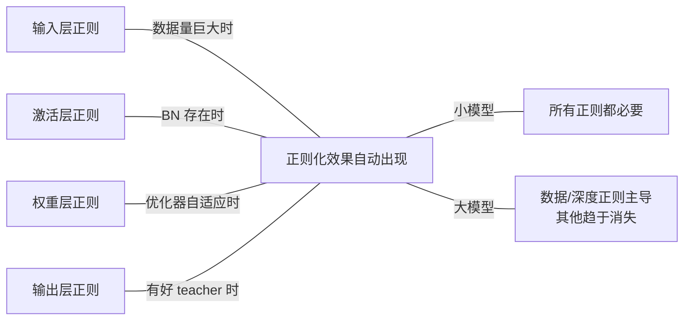

# A-3 · 学习率调度与 Batch Size 的几何 · SGD 作为 SDE 与 Scaling Law 的微观基石

---

---

1. **「正则化的有效维度随模型规模迁移」** —— 小模型时代权重/激活正则主导；大模型时代数据/深度正则主导。这条规律可能提示下一代正则该在哪条轴上找（可能是"数据轴" × "深度轴"的乘积空间）。
2. **「Stochastic Depth = ResNet 集成身份的显式化」** —— ResNet 的 unraveled view 是 $2^L$ 条路径的集成；Stochastic Depth 把这个隐式集成训练目标化。
3. **「Label Smoothing ∈ KD 家族」** —— Label Smoothing 是 KD 的退化特例（teacher = 均匀分布）。正则、蒸馏、信息瓶颈是同一本体论的三重显化。
4. **「四层正则可替代性定理」** —— 输入/激活/权重/输出四层正则共享数学结构 $mathcal{L}*{text{reg}} = mathbb{E}*eta mathcal{L}(T_eta cdot)$，因此在效果上高度可替代。加得够重的一层可以消灭其他层。
5. **「正则化不是降容量，是塑造容量形状」** —— Zhang 2017 的随机标签实验摧毁了经典叙事。正则化在无限容量的假设空间里挑出特定形状的解子空间。

## 九 · A-2 立卡命题

**核心命题**：**正则化 = 共形结构在"训练过程"这个场上的显式注入**。五种正则对应共形六轴的五种投影——它们不是"五种技巧"，是**对同一个共形约束的五种不同表达**。

| 方法 | 主要作用轴 | 本体操作 |
| --- | --- | --- |
| 数据增强 | **材料** | 训练分布的形状 |
| Dropout/DropBlock | **动力** | 前向计算的随机化 |
| Stochastic Depth | **时间尺度** | 深度维的随机展开 |
| Weight Decay | **度量**（参数空间） | 参数的几何偏好 |
| Label Smoothing/KD | **主体性**（目标端） | Teacher 的存在 |

## 八 · 共形六轴归位

---

**观察**：从 ResNet 到大模型，传统正则（Dropout、Label Smoothing）**逐步消失**，数据/深度正则（增强、Stochastic Depth）**强度提高**。这是"**正则化的有效维度随规模变迁**"的直接证据。

| 模型规模 | 数据增强 | Dropout | Weight Decay | Label Smoothing | Stochastic Depth |
| --- | --- | --- | --- | --- | --- |
| ResNet-50 | 中 | 0 | 1e-4 | 0.1 | 0 |
| ViT-Base | 强 | 0.1 | 0.05 | 0.1 | 0.1 |
| ViT-Huge | 强 | 0 | 0.05 | 0 | 0.3 |
| GPT-4 级 | 不适用 | 0 | 0.1 | 0 | 不适用 |

**经验规律**（当代大模型训练的实际参数）：

## 七 · 四层正则的"替代性图"——一个直观总结

---

**深层含义**：weight decay 的"先验"身份在 Adam 下被扭曲，必须解耦才能恢复它的真正作用（Flat Minima 导航）。这说明**优化器和正则之间有非平凡的耦合**——不能简单把正则"加到 loss 里"就完事。

**这看似微小的修正**在 BERT、GPT、ViT 训练里**至关重要**——现在大模型训练几乎全部使用 AdamW。

Loshchilov & Hutter 2019 指出：Adam + L2（加到 loss）≠ Adam + Weight Decay（直接衰减权重），因为 Adam 的自适应学习率会**改变 L2 的有效强度**。他们提出 AdamW：把 weight decay 从 loss 解耦，直接作用在权重上。

### §6.3 AdamW 的修正（2019）

所以 Weight Decay 不只是"贝叶斯先验"——它是**优化轨迹的几何导航器**。

1. Weight Decay 持续推权重变小 → 优化轨迹偏向平坦区域
2. 平坦的极小值 → 对参数扰动鲁棒 → 更好泛化（Flat Minima 假说）
3. 小权重 → 梯度的 Hessian 主特征值小 → 损失曲面局部更平坦

机制：

Keskar 2017、Hoffer 2017、Zhang 2019 揭示：在**深度网络 + SGD** 设置下，weight decay 的效果远超贝叶斯先验能解释的——它是 **Flat Minima 的引擎**。

### §6.2 SGD 解读（2017-）：Flat Minima 引擎

L2 正则等价于对权重施加高斯先验 $theta sim mathcal{N}(0, 1/lambda I)$。MAP 估计 = MLE + L2。这是教科书解读。

### §6.1 经典解读（1988-2015）：贝叶斯先验

Weight Decay 是四层正则里最古老（1988）也最简单（加个 L2 惩罚）的。但它经历了多次重新理解：

## 六 · Weight Decay 的深度解读——最古老也最持久的正则

---

这进一步佐证：**正则化的有效维度随模型规模变化**。小模型：权重/激活正则主导；大模型：深度/数据正则主导。

**为什么 DropPath 在 Transformer 时代变成"必需品"**？因为现代大模型的深度（ViT-L 24 层 → ViT-H 32 层 → 200+ 层）远超 ResNet 时代，深度维的正则成为**最关键的正则维度**——Dropout 和 Weight Decay 在大模型里效果微乎其微，DropPath 是**唯一持续有效**的正则手段。

- Swin：同样机制
- ConvNeXt：同样机制
- ViT：每个 Transformer block 以概率 $p_l$ 被跳过（$p_l$ 随层数线性增加，深层跳得更勤）

Stochastic Depth 在 2020 之后被重命名为 **DropPath**，成为 **ViT、Swin、ConvNeXt** 的标配。同一机制，新名字：

### §5.2 Stochastic Depth → DropPath → 现代 Transformer

**所以 Stochastic Depth 的本质不是"drop"，是"把 ResNet 的隐式集成身份显式化为训练机制"**。

- 梯度流的平均路径缩短 → 实际训练深度远小于 1202
- 每个 subnet 被**直接优化**，而不是被动形成
- 训练时随机丢 residual block = 显式训练不同深度的 subnet

**Stochastic Depth 是这个集成观的训练时直接落地**：

**Veit 的关键实验**：在训好的 ResNet 上随机 drop 若干 residual block，**精度平滑下降，不突变**——说明每个 block 不承载 critical 功能，网络是**真正的集成**。

这个展开式告诉我们：**$L$ 层的 ResNet ≡ $2^L$ 条不同深度路径的集成**，每条路径是一个 subnet。

$y = x + F_1(x) + F_2(x + F_1(x)) + F_3(x + F_1(x) + F_2(\ldots)) + \ldots$

**深层解释基于 Veit 2016《Residual Networks Behave Like Ensembles of Relatively Shallow Networks》——"unraveled view"**：

表面解释是"梯度消失/爆炸被随机跳过所缓解"。但这个解释不完整——为什么随机跳过能缓解？

原始论文（Huang 2016）的数据很震撼：1202 层 ResNet 用普通训练**发散**；加 Stochastic Depth **收敛到 SOTA**。

### §5.1 为什么 Stochastic Depth 让 1202 层 ResNet 收敛？

## 五 · Stochastic Depth 的深度解读——ResNet 的"集成身份"与 Unraveled View

---

这是 B-7（蒸馏）、A-2（正则）、信息论（IB）三条线在同一坐标下的交汇——正是我们"相关性是本体"框架要处理的主题。

**三者共同的事情**：降低 Y 端的尖锐度 → 减少表征对 X 的过拟合。

- IB：显式最小化 $I(T; X)$
- KD：在标签端换更软的分布
- LS：在标签端加噪

**所以 Label Smoothing、Knowledge Distillation、Information Bottleneck 是同一本体论的三重显化**：

Label Smoothing **在 $Y$ 端注入噪声** → 降低 $I(T; Y)$ 的最大可能值 → 迫使 $T$ 不要过度拟合 $Y$ 中的每个 bit → **隐式降低 $I(T; X)$**。

从 Tishby 的 Information Bottleneck：训好的网络学到 $T = f(X)$ 是 $(X, Y)$ 的"充分统计量 + 最小描述"——最大化 $I(T; Y)$ 同时最小化 $I(T; X)$。

### §4.3 身份 3：信息瓶颈视角

(c) **Label Smoothing 的 representation 坍缩问题**：同一篇论文观察到 LS 使倒数第二层的类间距离更等距——**破坏了 class hierarchy 在表征空间的自然保留**。这对下游蒸馏有害。

(b) **更好的 teacher → 更好的"正则"**：KD 比 Label Smoothing 强，因为 teacher 携带了 class confusion 的结构信息（"cat 更像 dog 不像 car"）。

(a) **正则化和蒸馏不是两件事**：Label Smoothing ∈ KD 家族，它的"正则"效果来自 KD 的"目标分布软化"效果。

这个等价有多个深层含义：

**Label Smoothing 是 KD 的退化特例：teacher 退化为均匀分布**。

$\tilde{y}*{\text{KD}} = (1-\alpha) \cdot \text{one-hot} + \alpha \cdot p*{\text{teacher}}$

而 Knowledge Distillation 的 target 是：

$\tilde{y} = (1-\epsilon) \cdot \underbrace{\text{one-hot}}*{\text{真标签}} + \epsilon \cdot \underbrace{\text{uniform}}*{\text{均匀 teacher}}$

精确地说，Label Smoothing 的 target 是：

> **Label Smoothing 的训练目标 = 一个"白痴 teacher"（均匀分布）的蒸馏目标。**
> 

这篇论文揭示了一个深刻等价：

### §4.2 身份 2：Müller-Kornblith-Hinton 2019 的决定性洞察——Label Smoothing ≈ 自蒸馏

所以模型不会追求 logit 爆炸，**权重会收敛到一个有界解**。这是"几何正则"的解读。

$\text{logit}_y^* = \log\frac{(1-\epsilon) + \epsilon/K}{\epsilon/K}$

CE + softmax 的 logit 无界——正确类 logit 可以越来越大，错误类越来越小，loss 越来越小但永远不为零。Label Smoothing 的 $epsilon/K$ 使**最优 logit 有限**：

### §4.1 身份 1：抑制 logit 爆炸的几何正则

Label Smoothing 把 one-hot $y$ 改成 $(1-epsilon) y + epsilon/K cdot mathbf{1}$。这个极简操作背后有**三个等价身份**。

## 四 · Label Smoothing 的深度解读——正则 / 蒸馏 / 信息瓶颈的三合一

---

**更深的解读**：Dropout 的有效性是**架构依赖**的，因为它依赖于"什么算独立单元"。CNN 的独立单元是通道（所以要 Spatial Dropout），Transformer 的独立单元是 token × channel。这说明正则化技术和架构是**匹配关系**，不是"通用工具"。

- 所以 Dropout 回归有效
- **激活的"独立单元"假设在 Transformer 里成立**
- FFN 层是 position-wise 的独立线性变换
- Attention 的 QK 权重之间没有 CNN 那种空间相关性

**Transformer 里的 Dropout**：

**CNN 里的 Dropout**：作用于空间高度相关的激活，效果弱。

Transformer 大量使用 Dropout（embedding / attention / FFN / residual 各一处），但机制完全不同：

### §3.3 Dropout 在 Transformer 里的回归——但机制变了

**这两个方案的共同哲学**：**正则化的噪声必须作用在"独立信息单元"上，否则无效**。这是 Dropout 理论的实际教训。

- **DropBlock** (Ghiasi 2018)：丢空间连续块——因为相关性的范围是空间邻域
- **Spatial Dropout** (Tompson 2015)：丢整个通道——因为通道是 CNN 的"独立单元"

**这催生了两个修正方案**：

Dropout 假设"每个激活单元承载独立信息"——丢掉一个，其他还在。但 CNN 的激活图**空间上高度相关**：一个像素的 drop 几乎不影响特征，因为邻域像素携带相同信息。所以传统 element-wise Dropout 在 CNN 上是**近乎无效的噪声**。

**更深的原因**：**Dropout 的假设与卷积特征不兼容**。

**表面原因**：BN 的出现。BN 把每层激活归一化到稳定分布，本身就起到类似"激活扰动"的作用。Dropout + BN 共用会干扰统计量，Li et al. 2019《Understanding the Disharmony between Dropout and Batch Normalization》给出了**方差偏移（variance shift）**的解释。

**原因是什么？**

- DenseNet、ResNeXt、EfficientNet：都不用传统 Dropout
- ResNet 2015：**全网无 Dropout**（第一次）
- VGG 2014：FC 层 Dropout
- AlexNet 2012：FC 层 0.5 Dropout，CNN 层不 drop

这是一个长期被回避的问题。看数据：

### §3.2 为什么 Dropout 在 CNN 衰落

- 冗余观：**特征分布式编码**（每个语义多单元存储）
- 贝叶斯观：**参数不确定性**（多种权重配置）
- 集成观：**宽度冗余**（多个 subnet）

这三重身份不矛盾——它们是同一个机制的三个解读角度：

- 这直接对应 **Lottery Ticket Hypothesis (Frankle & Carbin 2019)** 的冗余观察：训好的网络里有大量可剪枝的"冗余电路"
- 每个语义必须被**多个单元冗余编码**
- Dropout 随机丢弃激活 → 模型**不能依赖任何单一单元**

**身份 3：冗余表征强制**（我们这里要深化的层次）

- **结论**：Dropout 是在学"权重的分布"，不是"权重的点估计"
- 推理时的 MC Dropout = 后验采样
- 训练 loss = 变分下界（ELBO）
- Dropout 等价于对权重 $theta$ 施加 Bernoulli 变分分布 $q(theta)$

**身份 2：变分贝叶斯**（Gal & Ghahramani 2016）

- 这是**正确但浅薄**的解释
- 推理时用全网络 = 近似 $2^n$ 个 subnet 的集成
- 训练时每 batch 随机掩蔽激活 = 训练一个 subnet

**身份 1：近似集成**（Srivastava 2014 原文解释）

### §3.1 Dropout 的三重身份

## 三 · Dropout 的深度解读——从变分贝叶斯到冗余表征

---

**这些"替代"不是工程巧合——它们是四层正则投影同一个本体论目标（有效容量的形状约束）的必然结果**。

- **Stochastic Depth 消灭了传统 Dropout**：深度维的随机性比宽度维的随机性更有效
- **Knowledge Distillation 消灭了 Label Smoothing**：蒸馏提供了比 label smoothing 更结构化的 soft target
- **大数据增强消灭了 Weight Decay**：SimCLR/DINO 时代 weight decay 可以降到 1e-5 甚至 0，因为数据层的正则已经足够
- **BN 消灭了 CNN 里的 Dropout**：BN 的激活统计稳定化已经起到类似"每步扰动激活"的作用

典型证据：

> **四层正则之间有强烈的"可替代性"**——如果一层加得够重，其他层可以减弱甚至去掉。
> 

**这解释了一个长期被忽略的现象**：

其中 $eta$ 是一个随机变量，$T_eta$ 是作用在 "数据 / 模型 / 目标" 上的某种扰动。**四层正则共享这个结构，差别只在扰动作用的位置**。

$\mathcal{L}*{\text{reg}}(\theta) = \mathbb{E}*{\eta}\big[\mathcal{L}(\theta; T_\eta(\text{data/model/target}))\big]$

**这四层的共同数学形式**：

| 正则层 | 注入噪声的维度 | 迫使模型依赖的"稳定特征" |
| --- | --- | --- |
| **输入层**（增强/Mixup/CutMix） | 数据空间的变换 | 对视觉变换不变的语义 |
| **隐层激活**（Dropout/DropBlock/Stoch-Depth） | 网络内部单元的存在 | 冗余的、分布式的特征编码 |
| **权重层**（L2/L1/WeightNorm） | 参数幅值 | 使用小权重也能完成任务的解 |
| **输出层**（Label Smoothing/KD） | 目标的尖锐度 | 对目标分布形状不敏感的决策 |

**每一层正则 = 在"模型的某种对称性不变量"上施加噪声**，迫使模型**学到在这种噪声下仍然稳定的特征**——这些稳定特征就是泛化的源泉。

你笔记里的四层表是对的，但表面。真正的结构是：

## 二 · 四层正则的深度解读——不是"四种方法"，是"四个投影方向"

---

这是整个 A-2 的真正本体论身份。

> **正则化不是限制容量的"大小"，而是塑造容量的"形状"——在无数个可能的解（它们都完美拟合训练集）里，把优化过程推向"泛化好"的那部分解空间。**
> 

所以正则化做的事**不是"降低容量"**，它做的是更精细的事：

**这个结果摧毁了"容量 → 泛化"的线性叙事**。深度网络的表达容量在任何经典意义下都是"过剩的"（over-parameterized），但它**依然泛化**。

- 所以"正则化 = 降低容量"无法解释泛化
- 加不加正则化，**都能 fit 随机标签**
- 同一个 ResNet 在真实标签上**泛化良好**
- ResNet 可以**完美拟合随机标签**的 ImageNet（训练精度 100%）

**然后 Zhang et al. 2017《Understanding Deep Learning Requires Rethinking Generalization》把它一枪打爆**：

经典统计学习理论（VC 维、PAC-Bayes、Rademacher complexity）告诉我们：降低模型容量 → 减少 overfitting → 提升泛化。这个叙事在 2017 年之前一直是正则化的解释框架。

## 一 · 重新定位——为什么"防过拟合"是错误的归类

---

这个视角一旦建立，A-2 里所有看似零碎的方法（Dropout / Weight Decay / Label Smoothing / Stochastic Depth / DropBlock / Shake-Shake）就全部落位——它们不是"一组技巧"，而是**同一张容量几何图上的不同投影操作**。

> **正则化不是"降低容量以避免过拟合"。正则化是"在无限容量的模型类里挑出特定形状的假设空间"。13 年的正则化史，是研究者逐步发现"容量"不是一个标量而是一个多维几何体、并学会在不同维度上对它施加形状约束的过程。**
> 

先给出本章的中心断言——它会重铸 A-2 的所有内容：

