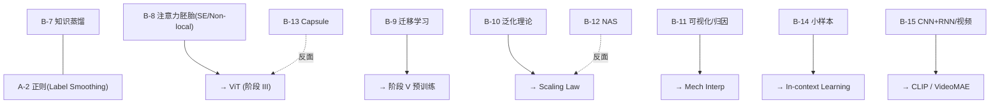

# 三级缺口 · 选补

## B-12 · 神经架构搜索(NAS)的早期

### 现象

- **Zoph & Le 2017《Neural Architecture Search with Reinforcement Learning》**(ICLR) — RL controller 生成架构,**800 GPU × 28 天**。狂野的开销。
- **NASNet**(Zoph et al. 2018, CVPR) — 在 CIFAR-10 搜 cell,迁移到 ImageNet。
- **ENAS**(Pham et al. 2018, ICML) — **权重共享**,把搜索开销降到单 GPU。
- **DARTS**(Liu, Simonyan, Yang 2019, ICLR) — **可微 NAS**:连续松弛 + 梯度下降。
- **EfficientNet**(Tan & Le 2019, ICML) — **compound scaling** 法则:深度 × 宽度 × 分辨率三维度协同缩放。
- **MobileNetV3**(Howard et al. 2019) — NAS + 手工的混合。
- 反思:**Li & Talwalkar 2019《Random Search and Reproducibility for NAS》** — 随机搜索基线几乎匹配 NAS。
- 后续:**Bello et al. 2021《Revisiting ResNets》** — ResNet 用现代 recipe 匹配 EfficientNet 。

### 本质

- **NAS 假设架构在离散空间可搜** — 但后来发现:搜出的架构主要贡献来自 **training recipe**,而非架构本身。
- **EfficientNet 的 compound scaling 是真正留下来的贡献** — 是**Scaling Law 在架构维度的版本**。它不是 NAS 的初衷(搜独特拓扑),但是 NAS 商业上最成功的产物。
- **DARTS 的机制**:在候选操作的软最大上做梯度下降 — 反向传播从架构选择重新框架为连续问题。

### 残差

- NAS 的方法论被 **scaling + 简单 Transformer** 压扁 — 暗示架构空间的细节不如规模重要。
- DARTS 的崩坏模式(skip connection 主导)被多个后续工作(R-DARTS、P-DARTS)指出。
- Capsule (B-13) 是架构先验的反面教材;NAS 是架构搜索的反面教材 — 两处都在告诉:架构不如 data + compute 重要。

---

## B-13 · Capsule Network(反面教材)

### 现象

- **Hinton, Sabour, Frosst 2017《Dynamic Routing Between Capsules》**(NIPS)。
- **Hinton et al. 2018《Matrix Capsules with EM Routing》**(ICLR)。
- 核心主张:
    - 用**向量**代替标量激活 — 向量的方向 = 部分姿态 / 属性
    - 用**动态路由**代替 pooling — 保留 part-whole 空间关系
    - Equivariance 应被架构硬编码,而非数据增强学出

### 为什么没成功

- **算力开销 O(n²) 级**,无法 scale 到 ImageNet。
- **经验收益有限**:同参数量下 ResNet 更强。
- 「Equivariance 应硬编码」的哲学被「数据增强 + self-attention 的学出来」路线**击败**。

### 本质教训

- **架构先验的正确性 ≠ 可训练性 + 可 scale 性**。
- 这条教训直接为 **ViT 的成功**铺路:ViT 几乎没有空间先验,但 scale + 数据压过了归纳偏置的优势。Inductive bias 在小数据时假设正确带来效率,在大数据时假设错误带来天花板。
- 与 NAS 的教训同构:**软式假设 + 规模 > 硬式假设 + 约束**。

---

## B-14 · 小样本学习的早期

### 现象

- **Koch, Zemel, Salakhutdinov 2015《Siamese Networks for One-shot》**。
- **Vinyals et al. 2016《Matching Networks》**(NIPS) — attention + memory,**episodic training** 范式。
- **Snell, Swersky, Zemel 2017《Prototypical Networks》**(NIPS) — 每类原型 = 特征均值,欧式距离。
- **Finn, Abbeel, Levine 2017《MAML》**(ICML) — 学一个初始化,使 k 步 gradient 后适配新任务。
- **Sung et al. 2018《Relation Network》** — 用可学习关系模块替代固定距离。
- 反思:**Chen et al. 2019《A Closer Look at Few-shot Classification》**(ICLR) — 强 baseline(冻结预训练 + cosine 分类)压过多数 meta-learning。

### 本质

- **两条分支**:
    - **Metric-based**(Matching / Proto / Siamese) — 把分类变成「表示空间的最近邻」 → 直接连度量学习(A-4)和后来的对比学习。
    - **Optimization-based**(MAML) — 把分类变成「fast adaptation 的优化问题」 → 引出 Meta-Learning 作为独立方向。
- **episodic training 范式的意义**:把「小样本」从测试时的形式变成训练时的形式 — 预示后来 in-context learning 的结构。

### 残差

- Chen 2019 的反思揭示:**小样本问题的真正矶要是表示质量,不是适配算法**。
- 真正解决要等 foundation model + prompting(阶段 V 之后)。
- MAML 的二阶梯度在实践中重 — FOMAML、Reptile 以一阶近似换替,满足功能。

---

## B-15 · CNN + RNN / 视频 / 多模态雏形

### 现象

**视觉 + 语言**

- **Show and Tell**(Vinyals et al. 2015, CVPR) — CNN encoder + LSTM decoder 做 image captioning。
- **Show, Attend and Tell**(Xu et al. 2015, ICML) — 加 **soft attention**。第一次在视觉-语言任务里引入注意力。
- **VQA**(Antol et al. 2015, ICCV) — Visual Question Answering 任务 + 数据集。
- **DenseCap**(Johnson, Karpathy, Fei-Fei 2016) — 区域 + 描述的联合。

**视频**

- **Two-Stream ConvNet**(Simonyan & Zisserman 2014, NIPS) — RGB + Optical Flow 双路 CNN for action。
- **C3D**(Tran et al. 2015, ICCV) — 3D 卷积做视频。
- **I3D**(Carreira & Zisserman 2017, CVPR) — Inception 的 3D 膨胀。Kinetics 数据集同期推出。
- **SlowFast**(Feichtenhofer et al. 2019, ICCV) — 慢分支高分辨率 + 快分支低分辨率。

### 本质

- **视觉 + 语言**:CNN + LSTM 是第一次把两种模态接起来 — attention 的引入为后来 Transformer 的统一铺路。这条线在 2021 被 **CLIP** 一处终结。
- **视频的时间先验三路线**:
    - (a) **双流**(运动 + 外观分离) — 把光流作为显式语义输入
    - (b) **3D 卷积**(时空联合) — 把时间当做第四个空间维
    - (c) **双时间尺度**(SlowFast) — 承认时间上存在多尺度信息
    - 本质都在「时间先验」里选择
- **DenseCap / VQA 的设计雏形**:为 **grounded language understanding** 定义任务形式 — 这些任务至今是视觉-语言模型的基准。

### 残差

- 这些工作在 ViT + VideoMAE + CLIP 之后被统一重构,但它们定义的任务和评测至今是基准。
- **Two-Stream 的光流依赖被 I3D / SlowFast 逐步剩除** — 显示「运动信息必须显式提供」的假设在足够大模型下失效。

---

## B-16 · 工具链编年史

- **2007 CUDA 1.0**(Nvidia) — 通用 GPU 计算可行。深度学习滩头的物质条件。
- **2011 cuDNN**(后续) — CNN 的 GPU 原语。
- **2014 Caffe**(Jia, Berkeley) — 第一个广泛使用的深度学习框架。静态图 + prototxt。AlexNet 复现的主要载体。
- **2014 Theano**(MILA) — 先驱(实际更早,2007起),2017 停止开发。
- **2015 TensorFlow 1.x**(Google) — 静态图 + 自动微分 + 分布式。时代主宰。
- **2015 Chainer**(PFN) — **动态图的先驱**,理念后由 PyTorch 继承。
- **2015 MXNet**(Amazon养大) — 混合静态+动态。
- **2016 Keras**(Chollet) — 高级 API,基于 Theano/TF。
- **2017 PyTorch**(FAIR) — 动态图,研究社区的决定性转向。
- **2019 JAX**(Google) — 函数式 + XLA,科学计算 + 大规模训练。pmap/vmap 的原语化。

### 本质

- 框架竞争的本质 = 「易用性 vs 性能」的平衡。
- **PyTorch 赢在 eager mode 的研究友好** — 调试体验与 Python 无差别。
- **JAX 赢在 scale** — pmap/vmap 把分布式和向量化变成函数变换。
- **容器化 + GPU 台架化** — NGC / A100 / H100 的硬件迭代与框架迭代同频。这是相容性的必要条件— 统一的计算接口使算力与模型解耦。

---

# 四级缺口 · 内容层反身

## B-17 · ImageNet 的选择偏见(类别级)

### 现象

**类别的来源 — WordNet 3.0**

- Fellbaum 1998 的语义网络:**定义了「概念是什么」**。但 WordNet 的偏见很具体:
    - **对狗特别细**(120 类 **Stanford Dogs 2011**) — 源于 Fei-Fei Li 的狗数据子项目,标注员是 Stanford 的研究生 — 不是兽医。类间边界由**研究生的情境知识**界定。
    - **对人的类别几乎没有**(隐私 + 标注成本) — 但有 person 的超类。
    - **对非英语文化概念欠代表** — 大量日式/印度/非洲日常物不在。

**AMT(Amazon Mechanical Turk)预算约束**

- 每类目标 ~1000 图,500 hit/标注员,$0.01–0.05 / hit。总预算约束决定了:
    - 类间样本严重不均,clean-up 后勉强平衡。
    - 易混淆类被简化(不同品种犬的边界由研究生界定,不是专家)。

**图像采集偏见**

- 主要来自 **Flickr 2006–2009**,那个时期的 Flickr 用户群(美国/西欧/技派健美 + 搅丝摄影爱好者)决定了文化地域偏见。

**标注偏见**

- 「主体居中 + 占据主要面积」是 AMT 界面的默认 — 导致 ImageNet 上的模型**对 off-center / 小物体表现弱** — **ObjectNet**(Barbu et al. 2019, NeurIPS)验证了这点。

### 本质

**ImageNet 不是「视觉的自然分布」,而是「2008–2010 年美国研究生眼里互联网中文化上可获取的可数名词」的投影**。模型学到的视觉世界,已经被这个投影**偏置塑形**。

### 残差

- **ImageNet-A**(Hendrycks 2019)、**ImageNet-C**(用 15 种腐蚀测鲁棒性)、**ImageNet-R**(画风变异)、**ObjectNet** — 压力测试系列。它们都在揭露:**ImageNet 顶鄇1% 与真实世界视觉性能解耦**。
- **Stanford Dogs** 在细粒度领域被用作代理,其实是**标注员专业化程度的产物**。
- **2020 Torralba & Efros《Unbiased Look at Dataset Bias》的后续**:证明能从图像分类到数据集来源 — 数据集偏见是可学的指纹。

---

## B-18 · Softmax + CE 的唯一性

### 问题

给定一个分类任务,**为什么用 softmax + CE,而不是 sigmoid + BCE / Hinge / MSE**?

### 理论推导

1. **Logistic regression 的极大似然 = softmax + CE**(K=2 退化为 logistic)。
2. **在所有 strict proper scoring rule 中**(Gneiting & Raftery 2007《Strictly Proper Scoring Rules》, JASA),只有 log-score 是局部的 — 即只依赖 observed outcome 的概率,不依赖未发生 outcome 的概率。这在哲学上千钟数学上制约了损失的形式。
3. **Softmax 的唯一性**:在 K 类分布的 sufficient statistics 假设下,softmax 是 **exponential family** 的**自然参数化** — 即 Boltzmann 分布。不是任意选择,是指数族在单形单项约束下的唯一形式。

### 工程优势

- **数值稳定**:log-sum-exp trick 让 log p 的梯度不溢出。
- **梯度形式干净**:∂L/∂z_i = p_i − y_i。这是**误差直接向后传**。MSE 在 softmax 输出上无此性质。
- **与 label smoothing / 知识蒸馏 / 激活 Mixup 的自然整合**:输入是分布时 CE 仍然适用。

### 为什么不是 MSE

- 在 softmax 输出上用 MSE 会让梯度在 p 接近 0 或 1 时**饱和** — 训练极慢。
- **MSE 对应高斯噪声假设**,与分类的离散输出不匹配。

### 为什么不是 Hinge

- Hinge 不产生标定概率 — 下游任务需要标定概率(检测打分、决策阈值、蒸馏)时 Hinge 失败。

### 本质

**softmax + CE 不是工程选择,是「最大似然 + exponential family + proper scoring rule」三重约束的唯一交集。**

### 残差

- **多标签分类**里 BCE 回归(每类独立 sigmoid) — 分布假设不同,所以 loss 不同。
- **度量学习 / 对比学习** 跳出 softmax 框架 — 使用不同的 scoring rule(InfoNCE 本质上是 log-score 的条件版)。
- **软标签场景**(mixup、label smoothing、distillation) — 把 CE 的「硬目标」假设打破,但仍然依托 CE 的数学结构。

---

## 三级缺口的共同主题

> **本质断言**:二级缺口(B-7 到 B-11)是**阶段 I 到阶段 V 的转译桥** — 没他们,阶段 I 与后续时代之间丢了中间层。三级缺口(B-12 到 B-16)是**阶段 I 末梢的旁侧分支**,有些是反面教材,有些是被后来架构统一。四级缺口(B-17、B-18)是**阶段 I 被接受的结论自己的地基反身**— 问「ImageNet 到底测量的是什么」和「为什么这个 loss」。
>