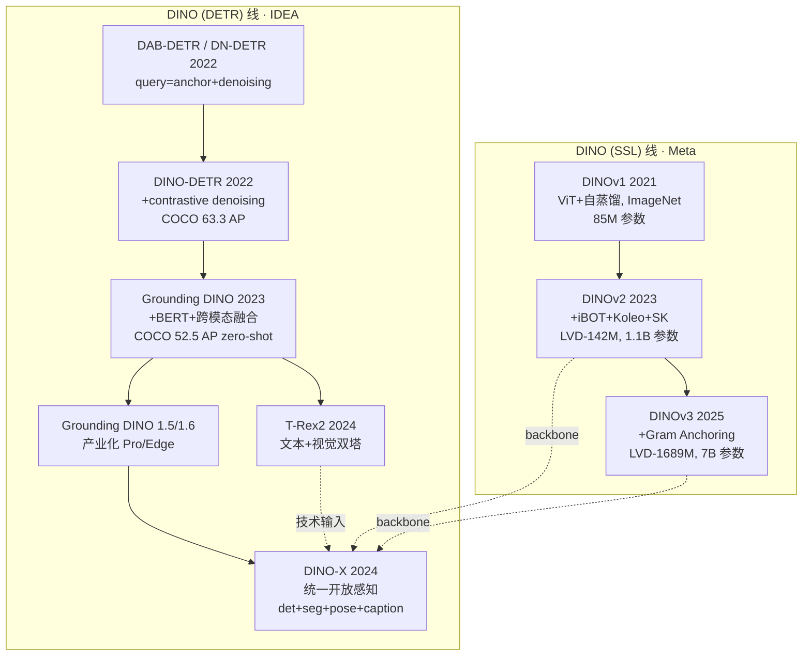
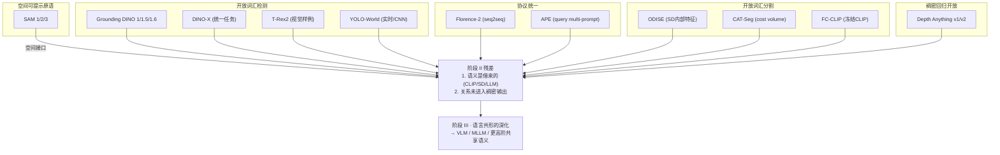

# 三线重定位：同名 DINO、开放词汇与通用稠密基础模型

> 页面定位：本页保留为材料总账。正式阅读入口已拆为 [05A-DINO-SSL线](05A-DINO-SSL线-语言无关视觉表征scaling.md)、[05B-DINO-DETR线](05B-DINO-DETR线-检测query与开放词汇.md)、[05C-Universal-Dense-Foundation线](05C-Universal-Dense-Foundation线-Florence2-DepthAnything-RADIO-SAMencoder.md)。三条路线不能混写成同一谱系。

本页标题仍叫“两条 DINO 线”，但实际内容承载了三条应该区分的路线：

1. **DINO (SSL) 线**：DINOv1/v2/v3，核心是语言无关的自监督视觉表征 scaling。
2. **DINO (DETR) 线**：DAB/DN/DINO-DETR -> Grounding DINO -> DINO-X，核心是端到端检测和开放词汇 query。
3. **Universal dense foundation 线**：Florence-2、Depth Anything、RADIO、SAM encoder 等，核心是把稠密视觉任务压到通用 backbone 与开放接口上。

这三条线在阶段 II 末端交汇，但不能混写成同一谱系。后续可将本页拆成三页；当前先用这段重定位防止读者把 DINOv3 和 Grounding DINO 误读成同一代际链。

# 第一条线 · DINO (SSL) —— 自监督视觉表征的 scaling

这条线的共形内核不变：**学生网络预测教师网络的输出（自蒸馏）+ teacher 是 student 的 EMA**。三代的差异全在**数据规模、架构细节、目标函数的工程修补**上。

## §1 · DINOv1 (2021-04, Caron et al., Meta, ICCV 2021)

**定位**：**自监督学习 + ViT 的第一次深度结合**。

**机制**：

- 两个 view（不同 crop + 不同增强）喂给同一个架构的 student 和 teacher
- **Student** 预测 **teacher** 的输出（softmax + centering + sharpening）
- **Teacher 不反向传播**——它是 student 的指数滑动平均（EMA momentum ≈ 0.996）
- 无对比学习、无负样本——单纯让 student 逼近 teacher

**炸裂的附带发现**（这是 DINO 真正的历史地位）：

- **self-supervised ViT 的最后一层 self-attention map，直接可视化就是物体分割**——**几乎等于 unsupervised segmentation**
- CNN 或 supervised ViT 都没有这个性质
- **kNN 分类在 ImageNet 拿 78.3% top-1**（完全不微调）

**它回答的本体论问题**：**视觉预训练不必依赖语言（CLIP）或标签（ImageNet 监督）**——纯视觉信号自己就能学出有语义结构的表征。[[1]](https://zhuanlan.zhihu.com/p/1943279068654056673)

**残差**：规模小（ViT-B/16, 85M），数据量有限（ImageNet），dense feature 不够稳定。

## §2 · DINOv2 (2023-04, Oquab et al., Meta)

**共形贡献**：**把 DINO + iBOT 的目标统一，并第一次做到大规模 scaling**。

**技术叠加**：

- **DINO loss**（全局 CLS token 自蒸馏）
- **iBOT loss**（patch-level masked image modeling，每个 patch 也做自蒸馏）
- **Koleo 正则**：显式要求 batch 内 embedding 的分布均匀（防塌缩）
- **Sinkhorn-Knopp 中心化**：替换 DINOv1 的 centering，提供更严格的分布约束

**数据工程突破**——**这才是 v2 最硬的贡献**：

- **LVD-142M**：从未标注网络图像里**检索+聚类**出的 1.42 亿张精选图像
- 检索种子：ImageNet、Google Landmarks、Mapillary 等 27 个"锚数据集"
- 对每个锚，在 1.2B 网络图像池里做 kNN 检索，保留相似度高的
- **策展式 + 去重**：用 embedding 做语义聚类去掉冗余

这个数据策展流程**直接影响了后面 SA-1B / DataComp / LLaVA 的数据哲学**——"质比量重要，但量也要很大"。

**性能**：

- ViT-g/14（11 亿参数），**冻结 backbone + 线性头**在 ADE20K 拿 49.0 mIoU
- 首次在**密集预测任务**上让 SSL 超过监督预训练

**DINOv2 的哲学意义**：**自监督不只是"没标签的监督"，它是一种不同的表征方式**——学的是视觉的几何/布局结构，不是语言的语义类别。所以它的表征和 CLIP 是**互补**而不是竞争——这一点直接催生了后续 MoF / RADIO 式的"组合视觉专家"方向。[[3]](https://www.notion.so/DINOv2-Learning-Robust-Visual-Features-without-Supervision-f0e748d64800821da63c819e0d395626?pvs=21)

**残差**：

1. 继续 scaling（10× 数据、10× 参数）时，**dense feature 开始退化**——patch embedding 的统计漂移
2. 分辨率不够灵活（14 固定 patch）
3. 长期训练后期性能反而下降

## §3 · DINOv3 (2025-08, Siméoni et al., Meta)

**共形贡献**：**用 Gram Anchoring 和精细工程把 SSL 推到 7B 参数 × 17 亿图像**——**单一冻结 backbone 在多个密集预测任务上 SOTA**。[[4]](https://hub.baai.ac.cn/view/48193)[[5]](https://hub.baai.ac.cn/view/48180)

**关键新机制 —— Gram Anchoring**（最核心的工程贡献）：

**问题诊断**：大规模长时间训练中，ViT 的 patch token 之间的**相似度结构**会漂移——具体表现为 patch feature 逐渐"平均化"，dense 任务（分割、深度）的性能先升后降。

**方案**：[[6]](https://zhuanlan.zhihu.com/p/1940074425849458833)

- 在训练中引入 **teacher 的 Gram 矩阵**（所有 patch 两两之间的 cosine 相似度矩阵）作为锚
- 约束 student 的 Gram 矩阵和 teacher 的 Gram 矩阵保持一致
- **关键**：这不是约束 **feature 值**本身，而是约束 **feature 之间的结构关系**

**为什么这是深刻的**：

- Feature 值可以漂移（模型适应新数据），但**feature 之间的相对几何不能崩**
- 这是"**保留结构而非保留绝对值**"的典型——**和 ResNet 的残差连接、LayerNorm 的放缩不变性是同一个哲学家族**
- 它部分回应了前文已经展开的"语言 vs 视觉 scaling 斜率不同"——**视觉的 scaling 需要额外的结构稳定器，语言不需要**

**其他工程层面**：

- **Axial RoPE**：把 2D 位置编码分解到两个轴上做 RoPE，比绝对 PE 对分辨率更鲁棒
- **Register tokens**（继承自 Darcet 2024 "Vision Transformers Need Registers"）：4 个可学习的"内存槽" token，吸收 patch token 中的高范数伪影
- **RoPE-box jittering**：训练时对位置编码加扰动，增强对分辨率/长宽比的泛化

**数据**：

- **LVD-1689M**（16.89 亿图，主要来自 Instagram 公开数据）
- **SAT-493M**（4.93 亿卫星图，独立训练分支）

**架构规模**：

- 主力模型 **ViT-7B**（70 亿参数）
- 蒸馏出 ViT-S / B / L / ConvNeXt Tiny/Small/Base/Large 全家族，便于部署

**性能（冻结 backbone + 轻量头）**：[[7]](https://cloud.tencent.com/developer/article/2588336)

- ADE20K 语义分割：ViT-B **51.8 mIoU**，ViT-L **54.9**，ViT-7B **60.7**
- NYU 深度估计：ViT-7B **AbsRel 0.309**
- 卫星 GEO-Bench：ViT-7B 分类 **81.1**、分割 **75.0**

**DINOv3 的哲学意义**：

- **承认 SSL scaling 不能"简单堆料"**——Gram Anchoring 是对"scaling 会自动 work"假设的工程抵抗
- **单一骨架、冻结权重、多个下游 SOTA**——这是视觉基础模型的理想形态："训一次、到处用"
- **SSL 线 scaling 的上限在哪**：ICCV 2025 "Scaling Language-Free Visual Representation Learning"[[8]](https://arxiv.org/abs/2504.01017) 的结论是——SSL 的 scaling 斜率**比 CLIP 更陡**，天花板更高。也就是说**DINOv3 还远没到顶**

## §4 · SSL 线三代的本体论轨迹

```
DINOv1 :  "SSL + ViT 能 work"              —— 证明存在性
          85M 参数, ImageNet-1.3M
DINOv2 :  "SSL 可以 scaling"               —— 证明大规模可行
          1.1B 参数, LVD-142M
DINOv3 :  "SSL 能超过监督/弱监督"          —— 证明上限更高
          7B 参数, LVD-1689M, Gram Anchoring
```

**三代共同的残差**：**SSL 不产语义标签**。DINOv3 的 ViT-7B 可以分割得比任何监督模型都好，但它**不知道它分割的是什么**——"这是一只猫"这件事它不会说。语义仍然要靠外挂（CLIP、LLM、或下游微调）。

这就是阶段 II 残差一"语义是借来的"的**根**——**纯视觉 SSL 结构性地不产语义**。

---

# 第二条线 · DINO (DETR) —— 端到端检测 + 开放词汇

这条线的内核是**可学习 query**（继承自 DETR）——和 SSL 线**完全无关**，只是名字撞了。

## §5 · 前身 · DAB-DETR & DN-DETR (2022)

在 DINO-DETR 之前，DETR 家族的两个关键修补：

**DAB-DETR** (Liu et al., ICLR 2022)：

- **Dynamic Anchor Boxes**——把 object query 从"抽象向量"改成"4D 锚框 `(x, y, w, h)`"
- 每层 decoder 都根据 query 的当前位置**动态调整 reference point**
- **本质**：把空间先验显式地塞进 query 的定义里

**DN-DETR** (Li et al., CVPR 2022)：

- **DeNoising training**：训练时给 GT 框加噪声变成"伪 query"喂给 decoder
- 让 decoder 学会"从一个近似正确的框收敛到精确框"
- **解决 DETR 收敛慢的问题**（前代 DETR 要训 500 epoch，DN-DETR 50 epoch 就行）

## §6 · DINO-DETR (2022-03, Zhang et al., IDEA, ICLR 2023)

**名字里的 DINO = DETR with Improved deNoising anchOr boxes**。

**共形贡献**：把 DAB + DN 合一，再加一个**对比去噪**机制：

- **Contrastive DeNoising (CDN)**：GT 框加两种噪声——**小噪声**（应该识别为 positive）+ **大噪声**（应该识别为 negative）
- 让 decoder 学会**拒绝**错误的 proposal，不只是**优化**正确的
- **Mixed Query Selection**：从 encoder 选出 top-k 作为 decoder 的初始 query，空间位置来自 encoder，内容向量是可学习的

**性能**：COCO 上 **63.3 AP**（ViT-L），当时**所有端到端检测器里最强**。

**DINO-DETR 在你的谱系里**：这是阶段 II §14（Anchor-free 与端到端查询）的**终点**——DETR 三步走 `query + matching + end-to-end` 被彻底打磨完。

## §7 · Grounding DINO (2023-03, Liu et al., IDEA, ECCV 2024)

**共形跃迁**：把 DINO-DETR 从**闭集**检测推到**开集**检测——**任意文本 phrase 都能作为检测目标**。[[9]](https://github.com/idea-research/groundingdino)

**架构核心 —— 紧耦合的跨模态融合**：

```
Text ("a yellow bus")          Image
   ↓                             ↓
BERT Text Encoder         Swin Image Encoder
   ↓                             ↓
   └──── Cross-modal Feature Enhancer ────┘
           (text ↔ image attention)
                     ↓
        Language-guided Query Selection
                     ↓
              Cross-modal Decoder
                     ↓
           Boxes + Phrase-level scores
```

**关键设计**——**三层跨模态融合**，不是只在最后对齐：

1. **Feature Enhancer**：encoder 里就让 image feature 和 text feature 相互 attention（6 层）
2. **Language-guided Query Selection**：用**文本 embedding**去选图像里最相关的 encoder output 作为 query 初始化
3. **Cross-modal Decoder**：decoder 里 query 既 attend image feature 也 attend text feature

**为什么这比 GLIP / Vild 更好**：

- GLIP 在特征对齐之后才做融合——**语义和位置在最后一刻才见面**
- Grounding DINO **从 encoder 开始就让两个模态互相塑造**——更深的融合

**损失函数的巧妙之处**——**把分类 loss 换成对齐 loss**：

- 传统 DETR：`CE(logits, class_id)`——闭集
- Grounding DINO：`Focal(sim(query_embed, text_token_embed), GT_match)`——**每个 query 对每个 text token 打 similarity 分数**
- 开集能力来自这里：**测试时的文本 token 不必在训练里见过**

**COCO 零样本**：**52.5 AP**——这是**闭集 SOTA 数字下的零样本**，非常惊人。

## §8 · Grounding DINO 1.5 / 1.6 (2024-05 / 2024-11, IDEA)[[10]](https://arxiv.org/abs/2405.10300)[[11]](https://visincept.com/blog/6/)

**共形贡献**：**产业化 —— Pro 追求强，Edge 追求快**。

**Grounding DINO 1.5 Pro**：

- 更强 backbone：ViT-L（替换原 Swin-T）
- 训练数据扩到 **2000 万+ grounding 标注**
- COCO zero-shot **54.3 AP**，LVIS-minival **55.7 AP**（+2-3 AP 相比原版）

**Grounding DINO 1.5 Edge**：

- 降低 feature scales，专为边缘部署优化
- 速度大幅提升（可在移动端跑）

**Grounding DINO 1.6 Pro**（2024-11）：

- COCO **55.4 AP**、LVIS-minival **57.7 AP**、LVIS-val **51.5 AP**
- **LVIS-rare 类（长尾罕见类）显著提升** —— +3.5 AP on LVIS-val
- 关键：**数据进一步扩容 + Supervised Prompt Tuning (SPT)**

**产业化的意义**：Grounding DINO 家族第一次让**开放词汇检测真正可用**——不再是"demo 漂亮但生产不行"。Grounded-SAM 这个工业组合（Grounding DINO 框 → SAM 分割）能成立，完全依赖 Grounding DINO 1.x 的落地级精度。

## §9 · DINO-X (2024-11, IDEA, arXiv 2411.14347)[[12]](https://medium.com/@ideacvr2024/exploring-the-dino-family-part-3-dino-x-a-unified-vision-model-for-open-world-object-detection-d9c32de26f24)[[2]](https://zhuanlan.zhihu.com/p/2022290422282691008)

**共形跃迁**：**从"开放词汇检测"到"统一开放世界感知"**——开放词汇从**类别**扩张到**任务族**。

**任务统一**：DINO-X 同一套架构支持：

- Open-World Object Detection + Segmentation
- Phrase Grounding（文本短语定位）
- **Visual Prompt Counting**（给一个样例，数图里有几个）
- **Pose Estimation**（关键点）
- **Prompt-Free Detection**（不给提示，直接找出所有对象）
- Dense Region Caption
- **Region-level 理解**（每个 region 都能回答问题）

**架构关键**——**三种 prompt 共存**：

```
Text Prompt      ("red fire hydrant")
Visual Prompt    (一张样例图 + bbox)
Custom Prompt    (用户定义的 concept embedding)
          ↓
   Unified Prompt Encoder
          ↓
    Shared Transformer Decoder
          ↓
    Task-specific Heads (det / seg / pose / count / caption)
```

**关键设计 —— Prompt-Free 模式**：

- 传统开放词汇：**用户必须给文本提示**才能检测
- DINO-X Pro 模式：**不给任何 prompt，直接 enumerate 图里所有对象 + 给每个 region 自动生成 caption**
- 这需要 **generic object query**——一组不绑定任何文本的 query，训练时从海量 grounding 数据里学到"什么是一个可数对象"

**性能**：

- LVIS-minival **56.0 AP**
- LVIS-val **59.8 AP**（超过 Grounding DINO 1.6 Pro）
- **PPhrase grounding 任务上同时是 SOTA**（以前需要专门模型）

**DINO-X 的哲学意义**：

- **"开放词汇"的真正定义不是"任意类别"，而是"任意任务"** —— 用户的意图可以用文本、可以用视觉样例、可以用 region、可以空（让模型自己决定）
- **这是 SAM 3 的直接前驱** —— 前文已经展开的 SAM 3 的"promptable concept segmentation"和 DINO-X 的设计高度同构，只是 Meta 做到了更大规模、更强的 concept encoder
- **它是阶段 II 末端"稠密任务统一化"的完全形态** —— 比 SAM 3 早一年，比 Florence-2 更细粒度

## §10 · T-Rex2 (2024-03, Jiang et al., IDEA, ECCV 2024, arXiv 2403.14610)

**共形贡献**：**文本提示 + 视觉提示的同空间协同** —— 解决 Grounding DINO 的"文本不会描述"盲区。

**问题**：

- Grounding DINO 对**常见类别**（有标准英语名字的东西）很强
- 对**长尾 / 专业 / 工业对象**（螺丝型号、医学器官子类、罕见昆虫）——**文本 prompt 根本没法精确描述**
- 这类场景在工业界极常见：标"这种特定零件"比"一个红色金属物"准确得多

**T-Rex2 的方案 —— 双塔对齐**：

```
Text "a bolt with hex head"    Visual example (1-2 张示例图 + bbox)
         ↓                                    ↓
    Text Encoder                      Visual Prompt Encoder
         ↓                                    ↓
         └──── Contrastive Alignment ────────┘
                        ↓
            Unified Prompt Embedding
                        ↓
                DETR Decoder
                        ↓
                    Boxes
```

**关键机制**：

- **对比学习**让 text prompt 和 visual prompt **在同一嵌入空间**里可互换
- 训练时同时用文本标注和视觉样例
- **测试时**可以：
    - 只给文本（传统开放词汇）
    - 只给视觉样例（few-shot detection）
    - 两者**都给**（相互校准，精度最高）

**工业意义**：

- **这是真正面向产业落地的设计** —— 工厂里标一个新零件，给 1-2 张样例就能上线
- 对应的是 **counting / inspection / rare object** 这些"文本无力"的任务
- 属性上和 **APE / SEEM / Visual Prompt-based** 一脉相承

**T-Rex2 在谱系里的位置**：它是 **DINO-X 的技术源头之一** —— DINO-X 里的 "Visual Prompt Counting" 能力直接继承自 T-Rex2 的双塔对齐。[[2]](https://zhuanlan.zhihu.com/p/2022290422282691008)

## §11 · DETR 线六代的本体论轨迹

```
DAB-DETR      : query = 4D anchor box             (空间先验入 query)
DN-DETR       : + denoising training              (收敛加速)
DINO-DETR     : + contrastive denoising           (闭集 SOTA)
Grounding DINO: + text encoder + 跨模态融合        (闭集 → 开集)
Grounding 1.5/1.6: + scale + data + SPT           (产业级)
DINO-X        : + 多任务 + 多 prompt              (开放类别 → 开放任务)
T-Rex2        : + 视觉-文本双塔对齐                (文本无力 → 视觉样例)
```

**这条线的核心张力**：**query 的表达力 vs 监督信号的丰富度**

- query 越灵活（从 4D anchor → 文本 embedding → 视觉 prompt），能承载的任务越多
- 但每加一种 prompt 类型就需要**新的监督数据 + 新的对齐机制**
- 最后收敛到 DINO-X 这种**"query 能被任意 prompt 条件化"**的设计

---

# §12 · 两条 DINO 线的唯一真实交汇点

这是关键的一点——**两条 DINO 线并不是永远平行的**。它们的交汇点是 backbone 层：

**DINOv2/v3 作为 Grounding DINO / DINO-X 的视觉 backbone**：

- Grounding DINO 原版用 **Swin-T**
- Grounding DINO 1.5 Pro 用 **ViT-L**（Swin → ViT 的过渡）
- **DINO-X 用 DINOv2 ViT**（[[12]](https://medium.com/@ideacvr2024/exploring-the-dino-family-part-3-dino-x-a-unified-vision-model-for-open-world-object-detection-d9c32de26f24) 里明确写：""ViT image backbone pre-trained with DINOv2""）
- 后续工作（Grounded-SAM 2、RADIO-based detector）有用 DINOv3 的

**所以"DINOv3 + Grounding DINO"这个短语在 2025 年以后是有意义的**——但含义不是"两代之间的演化"，而是"**SSL 线做 backbone，DETR 线做 task head**"——两条线**组合**而不是**继承**。

这个组合本身也是一种共形结构的确认：

- **SSL 线负责"看清楚"** ——提供高质量的 dense feature（Gram 稳定、高分辨率、多尺度）
- **DETR 线负责"问问题"** ——提供 query 机制、文本/视觉 prompt、任务头
- **两者的能力正交**——前者是**表征**，后者是**接口**

这也回应了前文已经展开的 SAM 架构：SAM 也是 image encoder（表征）+ prompt encoder + mask decoder（接口）的正交分工。**整个阶段 II 末端的所有基础模型，都是"表征 + 接口"两层架构**——这是一个普遍的共形模式。

---

# §13 · 对你的谱系的具体影响

**页面 [阶段 II · 提示化与开放词汇：稠密共形的开放——阶段 II 的出口与阶段 III 的入口（SAM / SAM 2 / Grounding DINO / DINO-X / T-Rex2 / YOLO-World / Florence-2 / APE / ODISE / CAT-Seg / FC-CLIP / Depth Anything）](00-定位卡.md) 目前的条目结构需要小修**：

- §3 "Grounding DINO / Grounding DINO 1.5" 现在的描述是对的但**只说到 1.5**，应补 1.6
- §4 "DINO-X" 的 "开放词汇从类别扩张到任务族" **完全精准**，无需改
- §5 "T-Rex2" 的 "文本-视觉提示协同" **完全精准**，但应补一句 "是 DINO-X 的技术源头之一"

**但最关键的是——页面目前完全缺失 SSL 线的 DINOv1-v3**。

这是一个结构性缺失：

- **SSL 线属于阶段 II 残差的"另一侧回应"** —— DETR 线回应的是"任务接口"（开集检测），SSL 线回应的是"表征质量"（dense feature 稳定）
- 两条线**都是**阶段 II 末端"基础模型化"的产物，**都应该被谱系收录**
- 如果只收录 DETR 线（现在的情况），谱系就变成了"检测史"，不是"视觉共形史"

**建议的结构修正**：

把页面 [阶段 II · 提示化与开放词汇：稠密共形的开放——阶段 II 的出口与阶段 III 的入口（SAM / SAM 2 / Grounding DINO / DINO-X / T-Rex2 / YOLO-World / Florence-2 / APE / ODISE / CAT-Seg / FC-CLIP / Depth Anything）](00-定位卡.md) 的主题从"提示化与开放词汇"**扩展**成两条支：

1. **A 支 · 表征化**：SSL 预训练的 scaling —— DINOv1 / v2 / v3（新增 3 条）
2. **B 支 · 接口化**：可提示、开放词汇的 task heads —— SAM / SAM 2 / SAM 3 / Grounding DINO / DINO-X / T-Rex2 / YOLO-World / Florence-2 / APE / ODISE / CAT-Seg / FC-CLIP / Depth Anything（现有 10 条）

两支的**残差并合**恰好定义阶段 III 入口：

- A 支的残差："SSL 不产语义"——**必须借 CLIP 或 LLM**
- B 支的残差："开放词汇借的是 CLIP 的语义"——**语义源头仍在外挂**
- 两支**同时指向**：**阶段 III 的核心任务是让视觉表征内生出语义/关系**（你已经在 [阶段 III 开篇论证](https://www.notion.so/%5B%5Bnotion-65%5D%5D) 或将要建的总纲里讨论过这个）

---

# §14 · 一张总图



**一句话总结**：

- **SSL 线**解决的是"视觉自己怎么学"——scaling 的数据+目标+稳定性问题
- **DETR 线**解决的是"视觉怎么被调用"——query+prompt+开放词汇+多任务
- **二者正交、互补、组合成基础模型** ——这就是 2024-2026 视觉基础模型的统一范式

---

从谱系完整性看，SSL 线的 DINOv1-v3 不应只是附注材料，而应作为正式条目回补到 [阶段 II · 提示化与开放词汇：稠密共形的开放——阶段 II 的出口与阶段 III 的入口（SAM / SAM 2 / Grounding DINO / DINO-X / T-Rex2 / YOLO-World / Florence-2 / APE / ODISE / CAT-Seg / FC-CLIP / Depth Anything）](00-定位卡.md) 的外围说明中。否则页面会只看见“开放词汇如何调用视觉”，却看不见“视觉自己如何先长成可调用的表征”。

## 6 · YOLO-World —— *Real-Time Open-Vocabulary Object Detection* (Cheng 等, CVPR 2024)

**共形贡献**：把 YOLOv8 与 CLIP 文本编码器融合，保留一阶段实时速度，同时开放词汇。证明「开放词汇」不是 Transformer 的专利——一阶段 CNN 路线也能吃下语义挂载。

🔗 [https://arxiv.org/abs/2401.17270](https://arxiv.org/abs/2401.17270)

## 7 · Florence-2 —— *Advancing a Unified Representation for a Variety of Vision Tasks* (Xiao 等, Microsoft, CVPR 2024)

**共形贡献**：把 caption / detect / segment / grounding / OCR 全部表达成「序列到序列」——同一个 encoder-decoder、同一种 prompt 协议统一所有稠密任务。预示稠密任务走向「提示 + 通用模型」的大方向。

🔗 [https://arxiv.org/abs/2311.06242](https://arxiv.org/abs/2311.06242)

## 8 · APE —— *Aligning and Prompting Everything All at Once for Universal Visual Perception* (Shen 等, CVPR 2024)

**共形贡献**：把开放词汇检测、分割、引用表达、grounding 全部统一成同一组 query 的不同提示——一个模型接管所有开放词汇稠密任务。

🔗 [https://arxiv.org/abs/2312.02153](https://arxiv.org/abs/2312.02153)

## 9 · ODISE / CAT-Seg / FC-CLIP (2023–2024)

**共形贡献**：开放词汇分割的三条技术路径——

- **ODISE** 用扩散模型的内部特征做语义（[https://arxiv.org/abs/2303.04803](https://arxiv.org/abs/2303.04803)）
- **CAT-Seg** 用 cost volume 把 CLIP 的相似度图蒸馏成分割（[https://arxiv.org/abs/2303.11797](https://arxiv.org/abs/2303.11797)）
- **FC-CLIP** 用冻结 CLIP 做全景分割（[https://arxiv.org/abs/2308.02487](https://arxiv.org/abs/2308.02487)）

三条路径都在证明同一件事：**稠密任务的「语义」部分可以完全外包给 CLIP，视觉侧只负责定位**。

好，接着把阶段 II 提示化组的最后五条一路推到 Depth Anything。这几条比 SAM / Grounding DINO 的历史重要性略低，**但它们是"开放词汇稠密化"的横向补完**——如果没有它们，你对这一组的图景就是残缺的：SAM 管点/框，Grounding DINO 管文本检测，**剩下的"CNN 实时 / 序列化统一 / 多任务 query / 分割三路 / 回归任务"这五个维度**全都靠下面这五条回应。

---

# §1 · YOLO-World —— 一阶段 CNN 路线的"语义挂载"

作者：Tianheng Cheng et al., Tencent AILab + Huazhong 科大,  CVPR 2024 Highlight, arXiv 2401.17270。

## 1.1 问题的真正意义

Grounding DINO 及其前身都建立在 **Transformer + query 机制**之上。这带来一个工业痛点：

**推理速度慢**——DETR 家族的 O(N²) cross-attention + 高分辨率 feature map 让 **Grounding DINO 在 A100 上也只有 1-3 FPS**。工业场景（实时视频、工业检测、自动驾驶）**根本不能用**。

YOLO-World 的问题是：

> **能不能让 YOLOv8 这种一阶段 CNN 检测器也吃下"任意文本 prompt"？**
> 

答案：能。而且**推理速度仍保持 52 FPS（V100）**——比 Grounding DINO 快 20-50 倍。

## 1.2 架构核心 —— RepVL-PAN + 离线词汇

```
Image  ─────────────────→  YOLOv8 Backbone (CSPDarknet)
                                    ↓
Text   ─→ CLIP Text Encoder  ─→  Text Embeddings (离线缓存)
                                    ↓
                       ┌────────────┴────────────┐
                       ↓                         ↓
            Image Feature Pyramid        Text-guided Feature Pyramid
                       └───── RepVL-PAN ─────────┘
                                    ↓
                    Text-contrastive Head (每个 box 对每个类名打相似度)
                                    ↓
                          Boxes + category names
```

**三个关键设计**：

**(1) RepVL-PAN (Re-parameterizable Vision-Language PAN)**：

- YOLO 原本的 PAN（Path Aggregation Network）是纯视觉的多尺度融合
- YOLO-World 把**文本 embedding 注入 PAN 的每一层**：
    - **Text-guided CSPLayer (T-CSPLayer)**：CNN 特征通过 text embedding 做 channel-wise 调制（max-sigmoid 激活）
    - **Image-Pooling Attention**：让 text embedding 从图像特征里 pool 出相关视觉信号
- **关键**：这是**双向融合**——图像影响文本，文本也影响图像

**(2) Text-contrastive Head 替换传统分类头**：

- YOLOv8 原来的分类头：`1×1 conv → 80 类 logits`
- YOLO-World：`1×1 conv → feature embedding`，然后 **feature ⋅ text_embedding** 做 similarity
- **和 Grounding DINO 同一个损失哲学**：把分类换成对齐

**(3) Prompt-then-detect 范式 + 离线词汇**：

- 传统开放词汇：**每张图都要跑一次 text encoder**——开销大
- YOLO-World：**用户先给一组词汇（"person, car, dog, ..."）**，离线用 CLIP text encoder 编码一次，之后所有图像共用
- **这是工程上最聪明的一步**：把开集能力的代价**平摊**掉

## 1.3 性能-速度 Pareto 前沿

| 模型 | LVIS zero-shot AP | FPS (V100) |
| --- | --- | --- |
| GLIP-L | 26.2 | 0.12 |
| Grounding DINO-L | 33.9 | 1.5 |
| **YOLO-World-L** | **35.4** | **52** |
- **精度超过 Grounding DINO-L**
- **速度快 35 倍**
- 在 LVIS rare 类上特别强（CNN 归纳偏置 + CLIP 文本泛化的组合）

## 1.4 YOLO-World 的本体论意义

这条线的哲学分量**比看起来大**：

**(1) 开放词汇不是 Transformer 的专利**

- 之前社区普遍认为"query 机制 + cross-attention"是开放词汇的必要条件
- YOLO-World 证明：**你只要有一个能把文本 embedding 注入视觉特征的融合机制，任何检测器都能吃下开集能力**
- CNN 的归纳偏置 + CLIP 的语义空间，**是互补而不是竞争**的

**(2) 工业落地的真正起点**

- Grounded-SAM 能跑成产品，主要是**Grounding DINO 1.5 + SAM 2**的组合
- 但**嵌入式、移动端、实时摄像头**的开放词汇检测，**YOLO-World 至今仍是首选**
- Roboflow、Ultralytics 把 YOLO-World 集成进了工业标准流水线

**(3) 残差**：

- 精度上限受限于 YOLO backbone（比 ViT-L 弱）
- Text-contrastive head 的粒度不如 DETR 的 query ↔ phrase 对齐细
- 对复杂场景（密集小物体、遮挡关系）依然弱
- 没有分割能力，只能给 box

---

# §2 · Florence-2 —— 把所有稠密任务压成 seq2seq

作者：Xiao et al., Microsoft, CVPR 2024, arXiv 2311.06242。

## 2.1 问题的重新定义

这是阶段 II 末端**最激进的统一**：

**之前**：不同任务需要不同的输出 head——检测头出 boxes、分割头出 masks、grounding 头出 region embedding、captioning 头出 tokens。每个 head 独立训练、独立推理。

**Florence-2 的主张**：

> **所有视觉任务都是"给一张图 + 一个 prompt，输出一段文本"**。
> 

把**框、掩码、关键点**都**token 化**进同一个文本 decoder 里。

## 2.2 架构 —— DaViT + Transformer Encoder-Decoder

```
Image ──→ DaViT (Dual Attention ViT) ──→ Visual Tokens (Flatten + Project)
                                                ↓
Prompt Text ──────────────────────────→  Concat ──→ Transformer Encoder
                                                ↓
                                          Transformer Decoder
                                                ↓
                                    Output Sequence (包含所有预测)
```

**核心是"location token"**：

- 词表里**额外加入 `<loc_0>` 到 `<loc_999>`** 共 1000 个特殊 token
- 这 1000 个 token 代表图像坐标（将图像空间量化到 1000 个 bin）
- 一个 box = 4 个 location token：`<loc_x1><loc_y1><loc_x2><loc_y2>`
- 一个多边形 mask = 一串 location token 序列（polygon vertices）

**同一个 decoder 输出的例子**：

| 任务 | Prompt | Output |
| --- | --- | --- |
| Caption | `<CAPTION>` | `A dog is sitting on a bench.` |
| Detection | `<OD>` | `dog<loc_10><loc_20><loc_40><loc_60>bench<loc_5><loc_50>...` |
| Grounding | `<CAPTION_TO_PHRASE_GROUNDING>a dog` | `<loc_10><loc_20><loc_40><loc_60>` |
| Segmentation | `<REFERRING_EXPRESSION_SEGMENTATION>the dog` | `<loc_10><loc_15><loc_12><loc_18>...` (polygon) |
| OCR | `<OCR>` | `STOP<loc_...>` |

## 2.3 FLD-5B —— 统一的数据引擎

Florence-2 的另一半贡献是 **FLD-5B 数据集**：

- **1.26 亿图**、**50 亿条标注**
- 每张图**多任务标注**——caption + bbox + mask + phrase grounding + OCR 并存
- 构建方式：用现有专业模型（GLIP、SAM、LLaVA）生成候选，再用迭代精炼
- **"一张图多种监督"是 Florence-2 多任务能力的根本来源**

## 2.4 性能 —— 小模型吃掉专用模型

- **Florence-2-B (230M 参数)** 在 10+ benchmarks 上 **match 或超过专用 SOTA**
- COCO captioning、COCO detection、RefCOCO、Flickr30k Entities 全部 SOTA 或近 SOTA
- **注意参数量**：230M 吃掉了好几个 1B+ 专用模型的地盘

## 2.5 Florence-2 的本体论意义

**(1) 这是阶段 II 和阶段 III 的分水岭信号**

Florence-2 不是"另一个多任务模型"——**它把视觉任务压缩成了"文本生成"**。这本质上是**把视觉问题转译成 NLP 问题**。从这里开始，**稠密任务和语言任务在架构上没有差别**——都是 seq2seq。

这正好是阶段 III 的入口之一：**统一的 token 空间**。LLaVA、GPT-4V、Gemini 的生成式 VLM 走的就是这条路——**一切都是 token**。Florence-2 是这个哲学在**闭集稠密任务**上的干净展示。

**(2) 与 SAM / Grounding DINO 的正交补完**

- SAM：空间原语（点击就出 mask）
- Grounding DINO：语义原语（文本就出 box）
- **Florence-2：协议原语**（同一个 prompt 协议吃所有任务）

三者共同定义了"可提示视觉"的三个维度：空间、语义、协议。

**(3) 残差**

- **location token 量化到 1000 bin 精度有限**——对需要 pixel-precise 的任务（医学、细粒度分割）不够
- **mask 用 polygon 表示**——复杂形状 tokens 很长，效率和精度都掉
- **seq2seq 推理慢**——一次只能出一个 token，不适合实时
- **"统一"的代价是每个单任务都不是 absolute SOTA**——只是"足够好"

---

# §3 · APE —— 一组 query 接管一切

作者：Yunhang Shen et al., Tencent YouTu + Fudan,  CVPR 2024, arXiv 2312.02153。

## 3.1 APE 的定位

在 Florence-2 之外，APE 提供了**另一条统一路径**——**不用 seq2seq，用 DETR query**：

**主张**：一组通用的 object query，通过**不同类型的 prompt**条件化，就能同时做：

- 开放词汇检测（文本 prompt）
- 开放词汇分割（文本 prompt + mask head）
- Referring Expression Segmentation（复杂句 prompt）
- Phrase Grounding（短语 prompt）
- 视觉-视觉 grounding

## 3.2 架构关键 —— "Prompt-all" 设计

```
Image ──→ ViT Backbone ──→ Encoder Features
                                    ↓
Multi-granularity Prompts:
  - Sentence ("a red car on the road")
  - Phrase ("red car")
  - Word ("car")
                                    ↓
                    Unified Prompt Encoder (CLIP + tokenization)
                                    ↓
              Object Queries ←→ Prompt-conditional Cross Attention
                                    ↓
              ┌─────────────┬──────┴──────┬──────────────┐
              ↓             ↓             ↓              ↓
          Box Head    Mask Head    Keypoint Head   Caption Head
```

**核心创新 —— "单个对齐 loss" 统一所有任务**：

- 传统做法：每种任务用不同 loss（detection loss / segmentation loss / grounding loss）
- APE：**所有任务都 reduction 到同一个 "query-prompt alignment" loss**
    - 每个 query 对每个 prompt token 做 similarity
    - GT 是"哪些 query 匹配哪些 prompt 部分"
- **这样训练数据可以混合**——detection 数据、grounding 数据、referring 数据联合训

## 3.3 性能 —— 真正的"一个模型接管"

APE-D 在 **160+ benchmark 上评估**：

- COCO detection: **58.3 AP**
- LVIS detection: **64.8 AP**
- RefCOCO REC: **92.3 Prec@1**
- RefCOCO RES: **75.3 cIoU**
- ODinW: SOTA

**关键**：**所有这些任务，一个模型、一套权重、不微调**——真正的"通用 perception"。

## 3.4 APE 和 DINO-X / SAM 3 的对比

APE → DINO-X → SAM 3 是**同一个演化方向的三代**：

| 模型 | 年份 | 特点 |
| --- | --- | --- |
| APE | 2024-06 | 同一组 query + 多 prompt 类型 |
| DINO-X | 2024-11 | • 视觉 prompt + prompt-free + 多任务 head |
| SAM 3 | 2025-11 | • presence head + concept encoder + 视频 |

**APE 是这条"统一 perception"思路的首个成熟形态**——虽然后来 DINO-X 和 SAM 3 更广为人知，但架构哲学上 APE 先到位。

## 3.5 APE 的残差

- 架构复杂，训练成本高
- 产业影响力被 DINO-X / SAM 3 压过
- 但学术上留下一个重要结论：**DETR query 作为通用 perception primitive 是可行的**

---

# §4 · ODISE / CAT-Seg / FC-CLIP —— 开放词汇分割的三条路径

这三条不是竞争关系，是**同一时期三种不同的"把 CLIP 接到 mask 上"的技术取舍**。把它们并列讲是因为它们**共同定义了"CLIP → dense segmentation"的三条标准路径**。

## 4.1 ODISE —— 借用扩散模型的"场景理解"

作者：Jiarui Xu et al., NVIDIA + UCSD, CVPR 2023 Highlight, arXiv 2303.04803。

**核心观察**：

- Stable Diffusion 的 U-Net 中间层 feature，在**定位任务**上表现极强
- 原因：SD 训练时需要理解"哪里是什么"才能精确地去噪生成——**生成模型内在就包含强定位能力**
- **这是 LDM 的意外赠礼**

**架构**：

```
Image → Stable Diffusion U-Net (frozen, t=0) → 中间层 Feature
                                                     ↓
                                             Mask Generator
                                                     ↓
                                             (per-mask features)
                                                     ↓
                              CLIP Text Embeddings → Similarity → 类别
```

**为什么用扩散模型做分割这件事重要**：

- 证明了**生成模型的中间表征包含判别模型难以学到的结构信息**
- "理解" 和 "生成" 在**同一个模型内部**共享
- **这直接预示了阶段 IV（生成共形的觉醒）的早期入口**——生成模型不只是"画图机"，也是"感知模型"

**残差**：扩散 U-Net 推理慢，工业上不实用。但学术启发大。

## 4.2 CAT-Seg —— 把 CLIP 相似度图蒸馏成分割

作者：Seokju Cho et al., Yonsei + Adobe, CVPR 2024, arXiv 2303.11797。

**核心洞察**：

- CLIP 原生就能对每个像素 patch 算"和这个类别的相似度" → 每个类别都有一张 similarity map
- **但这个 similarity map 很糙**——因为 CLIP 的 patch embedding 是全局对齐的，不适合像素级
- 需要一个机制把"糙的 similarity map"**精炼**成"精细的 mask"

**技术路径 —— Cost Volume Aggregation**：

```
(Image, Category "cat")  →  CLIP  →  Similarity Map H×W
                                            ↓
                      Cost Volume: [H × W × |Classes|]
                                            ↓
                 Spatial Aggregation (local conv over H, W)
                                            ↓
                Class Aggregation (attention over |Classes|)
                                            ↓
                        Refined Mask
```

**关键**：Cost volume 这个概念来自光流估计——**把"每个像素对每个候选的打分"作为一阶信号，再做二阶聚合**。

- **Spatial aggregation**：让相邻像素的打分互相影响（空间平滑）
- **Class aggregation**：让相关类别的打分互相协调（语义一致）

**意义**：

- **不需要训练新的 CLIP** —— CLIP 原样冻结
- **只需要训练一个轻量 aggregator** —— 极其便宜
- **A-150 / A-847 / PC-59 / PC-459 多个 benchmark SOTA**

## 4.3 FC-CLIP —— 冻结 CLIP + 单阶段全景

作者：Qihang Yu et al., ByteDance + Johns Hopkins, NeurIPS 2023, arXiv 2308.02487。

**最关键的一点**：**CLIP 完全冻结，不做任何微调**。

**为什么这是洞察**：

- 之前的开放词汇分割方法（MaskCLIP, OpenSeg）**都要微调 CLIP**
- 但微调 CLIP 会**破坏它原来的视觉-语言对齐**——开集泛化能力下降
- **FC-CLIP 的主张**：CLIP 就应该保持原样，**新加的模块处理定位**

**架构**：

```
Image → Frozen ConvNeXt-CLIP → 多尺度 Feature
                                      ↓
                              Mask Generator (Mask2Former 式)
                                      ↓
                              Per-mask Features
                                      ↓
        Text Embeddings (CLIP 原生) → Similarity → 类别
```

**性能**：

- **ADE20K panoptic PQ 26.8** —— 开放词汇全景分割 SOTA
- **一个模型同时做**：panoptic / instance / semantic segmentation
- **零样本到 Cityscapes、Mapillary Vistas**

**FC-CLIP 的本体论意义**：

- 证明了**"让 CLIP 保持原样、只加外接模块"是比微调更好的策略**
- 这个哲学直接影响了 SAM 3 的 concept encoder 设计、RADIO 的聚合蒸馏设计
- **冻结基础模型 + 轻量任务模块** 成为阶段 II 末端的标准做法

## 4.4 三条路径的共同结论

| 方法 | 语义来源 | 定位来源 | 特点 |
| --- | --- | --- | --- |
| ODISE | Stable Diffusion | SD 内部 feature | 借生成模型 |
| CAT-Seg | CLIP | Cost volume 聚合 | 轻量后处理 |
| FC-CLIP | CLIP (frozen) | 独立 mask generator | 架构解耦 |

**三条路径都验证了一件事**：

> **稠密分割的"语义"部分可以完全外包给预训练模型（CLIP 或 SD），视觉侧只负责"哪里"的问题。**
> 

这正是阶段 II 残差一"**语义是借来的**"最显式的体现。三篇论文都不回避这一点——它们**就是要借**，而且证明了借得漂亮可以达到 SOTA。

这也是**为什么阶段 III 必然到来**：借久了就发现**借不够**。CLIP 的语义粒度限制住了所有借 CLIP 的方法——MMVP 盲对、属性混淆、语言先验压制，都是"借来的语义"的代价（前文已经展开的）。

---

# §5 · Depth Anything v1 / v2 —— 稠密回归走进零样本时代

作者：Lihe Yang, Bingyi Kang, Zilong Huang, Xiaogang Xu, Jiashi Feng, Hengshuang Zhao (TikTok + HKU + Zhejiang), CVPR 2024 / NeurIPS 2024。

## 5.1 为什么这条很特殊

前面所有条目（SAM、Grounding DINO、Florence-2、APE、开放词汇分割三家）都是**分类/检测/分割**——**离散空间**的任务。

**Depth Anything 是第一个把"零样本 + 大规模预训练"范式推进到稠密回归任务的工作**。深度估计输出的是**每个像素一个实数**（距离/视差），不是离散类别。

这一步很重要：**证明了"基础模型 × 零样本" 不局限在分类任务族，对连续输出也成立**。

## 5.2 v1 的技术核心 —— 数据引擎 + 伪标签蒸馏

**问题**：深度监督标注**极其昂贵**——需要 LiDAR / 深度相机 / 结构光，只能在少数场景拿到。MiDaS 等前作只有 **2M 标注数据**。

**Depth Anything v1 的方案**：

```
Stage 1: 用 1.5M 标注数据训练 Teacher
              ↓
Stage 2: Teacher 对 62M 未标注图像生成伪深度
              ↓
Stage 3: Student (更大模型) 在 1.5M 真 + 62M 伪上联合训练
              +强增强+语义辅助 (DINOv2 feature alignment loss)
              ↓
        Depth Anything v1 (ViT-L, 强零样本)
```

**关键 tricks**：

- **CutMix / ColorJitter 强增强**：让 student 被迫学到"不变的几何线索"而非表面纹理
- **DINOv2 语义蒸馏**：要求 student 的 feature 对齐 DINOv2 ——**把语义理解注入几何任务**
- **62M 张网络图 bootstrap**：数据工程是 SAM 哲学的迁移

## 5.3 v2 的改进 —— 合成数据 + 教师更新

**v2 的发现**：

- v1 的问题是**对透明物体、反光物体、复杂边界处理差**——因为真实深度数据里这些 case 少
- *合成数据（渲染引擎生成）**在这些 case 上标注完美
- 但合成数据有 **domain gap** → 不能直接用

**v2 的做法**：

1. **纯合成数据训 Teacher**（精度极高但 domain gap 大）
2. Teacher 在**真实未标注图像**上打伪标签（domain gap 被吸收到伪标签里）
3. 更大 Student（ViT-L/G）在**真实伪标签数据**上训练 —— **同时拿到"高精度 + 域泛化"**

**性能**：

- NYU / KITTI zero-shot **SOTA**
- **细节尖锐度远超 v1**（头发、绳索、反光物体）
- Relative depth 可以转换为 metric depth（after affine calibration）

## 5.4 Depth Anything 在你谱系里的位置

**阶段 II 残差的最后一块拼图**：

- 阶段 II §13（检测流水线）、§14（端到端检测）、§15（统一 mask）、§16 前半（SAM/Grounding/APE/Florence）—— **全都在解决离散任务的稠密化**
- **Depth Anything 是回归任务的稠密化+零样本化**——**完成了阶段 II 的最后一块**

**共形贡献总结**：

- SAM 做到"分割任何东西"
- Depth Anything 做到"估计任何距离"
- **两者加起来 ≈ "感知任何几何属性"**——空间关系（Where）的基础模型双子星

## 5.5 Depth Anything 之后的衍生

- **Depth Pro** (Apple, 2024)：metric depth，更精确
- **Marigold** (2023)：用扩散模型做深度（和 ODISE 一脉）
- **Depth Anything V2** 的 **metric 版**也相继发布
- **Unidepth / ZoeDepth**：metric + relative 混合

**Depth Anything 系列已成为稠密回归基础模型的事实标准**——就像 SAM 之于分割。

## 5.6 残差

1. **仍是相对深度为主**——metric depth（真实米数）需要额外 calibration
2. **动态场景/视频**：单帧预测，帧间可能不一致（有 Video Depth Anything 在补）
3. **极端场景**（水下、红外、遥感）泛化有限——**domain 专门化问题**（这和 SAM 在医学/遥感的问题同构）

---

# §6 · 把这五条放一起看：阶段 II 末端的五种"开放"

这五条模型不是简单的并列，它们定义了**开放词汇 / 开放感知在五个不同维度上的展开**：

| 维度 | 代表作 | "开放"的含义 | 关键代价 | 架构载体 | YOLO-World | CNN 也能开集 (不限 Transformer) | 精度上限 |
| --- | --- | --- | --- | --- | --- | --- | --- |
| 任务协议 | Florence-2 | 所有任务压成 seq2seq | 量化精度 + 推理慢 | Query 机制 | APE | 一组 query 接多种 prompt | 训练复杂 |
| 语义来源 | ODISE/CAT/FC-CLIP | 借 CLIP/SD 做分割语义 | "借来的语义" | 输出类型 | Depth Anything | 开放到连续值回归 | metric / 动态 |

**五个维度一起定义了"稠密共形在阶段 II 末端的最大伸展"**：

- 任何 backbone（CNN / ViT）
- 任何 prompt 协议（box / text / referring / seq prompt）
- 任何 query 方式（DETR / YOLO / seq2seq）
- 任何语义源（CLIP / SD / concept encoder）
- 任何输出空间（离散类 / box / mask / depth）

**五个维度的公共结论**：

> **阶段 II 末端，视觉感知被彻底"解耦"成"表征 + 接口 + 外部语义"的三层架构**。
> 

> • **表征**：ViT / CNN / SAM encoder / DINOv2
> 

> • **接口**：query / prompt / seq token
> 

> • **语义**：CLIP / SD / 人工文本
> 

**三层架构的稳定性 + 外部语义的借用** = 阶段 II 的**工程胜利** + **本体论残差**。

---

# §7 · 阶段 II 终结的完整定位

现在你整个页面从 §1 到 §10 的结构图景应该是这样的：



**共同残差的两条，这十组模型都没有解决**：

1. **语义借来** —— FC-CLIP 把这件事做到极致（完全冻结 CLIP），但也正因为冻结，所以"CLIP 有多盲，它就多盲"（MMVP 传递）
2. **关系未进入稠密输出** —— Florence-2 能生成 caption，但 caption 是后验叙述，不是稠密结构化关系（scene graph、affordance graph 都缺）

**这两条残差加起来就是阶段 III 的召唤书**。

---

# §8 · 一个更尖锐的观察

阶段 II §16（这个页面）里的 13 个条目（SAM 1/2/3/3.1 + Grounding DINO 1/1.5/1.6 + DINO-X + T-Rex2 + YOLO-World + Florence-2 + APE + ODISE/CAT-Seg/FC-CLIP + Depth Anything v1/v2），**没有一个能在不依赖外部语言/文本监督的情况下完成"任意概念的开集识别"**。

- SAM 1/2 没有语义
- Grounding DINO / DINO-X / YOLO-World **依赖 CLIP text encoder**
- SAM 3 **有自己的 concept encoder**，但训练数据**仍是文本 prompt + 人类标注**
- Florence-2 **吞了 LLM 风格的 decoder**，已经是半个 VLM
- 开放词汇分割三家 **全部借 CLIP / SD**
- Depth Anything 不涉及语义

**唯一"自己产语义"的方向是纯 SSL（DINOv2/v3）——但 DINO 自己不会说"这是什么"**。

**于是阶段 II 的最终图景是**：

- 视觉自己能"看清楚"（DINOv3）——但不会说
- 视觉借语言能"说清楚"（CLIP / Grounding DINO / SAM 3）——但受语言粒度限制

**这两半**就是阶段 III 必须缝合的伤口——**让"看清楚"和"说清楚"在同一个模型内部有机体化**。这正是 VLM / MLLM / 世界模型的历史任务，也是你谱系里阶段 III 的入口。

---

这十条模型加 SAM 系列一共 13 个条目，至此阶段 II §16 的深度展开**全部完成**。页面 [阶段 II · 提示化与开放词汇：稠密共形的开放——阶段 II 的出口与阶段 III 的入口（SAM / SAM 2 / Grounding DINO / DINO-X / T-Rex2 / YOLO-World / Florence-2 / APE / ODISE / CAT-Seg / FC-CLIP / Depth Anything）](00-定位卡.md) 目前的状态是：§1 §2（SAM / SAM 2）**有**深度展开正文（已在页面中）、§3 §4 §5（Grounding DINO / DINO-X / T-Rex2）**有短条目 + SSL/DETR 双线展开材料**、§6-§10（YOLO-World 到 Depth Anything）**短条目 + 本轮展开**。

累积下来待整合的深度内容 = SAM 全系列展开 + 视觉 scaling 本体论分析 + VLM 看不清机制 + DINO 双线展开 + 本轮的 YOLO-World/Florence-2/APE/分割三家/Depth Anything——约 25000 字。

这些内容的意义不止于补充材料，而是帮助 §16 真正形成“双线并进”的闭合结构：一条线解释语义如何被挂载，另一条线解释视觉表征如何先被做强。只有两条线同时出现，阶段 II 的出口与阶段 III 的入口才会显得完整。

## 10 · Depth Anything v1 / v2 (Yang, Kang, Huang, Xu, Feng, Zhao, CVPR 2024 / NeurIPS 2024)

**共形贡献**：用大规模未标注图像 + 教师-学生蒸馏，把单目深度估计推到「零样本 + 任意域」。**稠密回归（不是分类）也进入了「大规模预训练 + 下游直接用」的范式**——稠密共形在回归类任务上的最终形态。

🔗 [https://arxiv.org/abs/2401.10891](https://arxiv.org/abs/2401.10891) · [https://arxiv.org/abs/2406.09414](https://arxiv.org/abs/2406.09414)

---

## 阶段 II 的终点、阶段 III 的入口

到这里，阶段 II 的三条原始残差全部被回应：

1. ✅ 空间内部坍缩 → 每一像素都有度量。
2. ✅ 度量对位置 / 形状 / 边界盲视 → Dice / IoU / PQ / 匹配损失 / 深度 RMSE 全家族。
3. ✅ 输出空间退化 → 框 / 掩码 / 关键点 / 深度 / 流场 / 轨迹 / 开放词汇任意概念。

但本组留下两条**无法在阶段 II 框架内解决**的新残差——它们恰好就是阶段 III 的入口：

### 残差一 · 语义是借来的

SAM 的提示原生支持点 / 框 / mask，**但它的文本提示能力一直没真正工作**——语义不在 SAM 自己的表征里。Grounding DINO、YOLO-World、APE、CAT-Seg、FC-CLIP 的「开放词汇」全部建立在 CLIP 的文本-图像对比表征之上——**视觉侧只负责定位，语义来自外部挂载**。

这是一个被产品叙事严重包装的点：当有人说「我们的模型支持开放词汇」，大多数时候意思是「我们把 CLIP 的文本塔接进来了」。真正视觉侧自己**推出**新语义、自己**命名**没见过的概念——这件事在阶段 II 里根本没有发生。

### 残差二 · 关系没有进入稠密输出

稠密输出回答了「哪里是什么」。但「谁和谁在一起」、「A 在 B 的上面」、「A 导致 B」——这些**结构化关系**不在任何稠密任务的定义里。稠密共形到此为止只建模了图像内部的像素级事实，不建模事实之间的关系。

<aside>
🌀

→ 这两条残差合起来定义阶段 III 的入口：**语言共形的深化**。视觉需要一个自己的共享语义接口（不再只是借 CLIP 做外挂），也需要一套能建模关系而不只是位置的架构。这最终会通向视觉-语言统一范式（VLM / MLLM）。

**阶段 II 的工程完成，等于阶段 III 的本体论必然性被暴露**。稠密共形做到极致之后，剩下的不再是「稠密什么」，是「语义从哪里来」。
