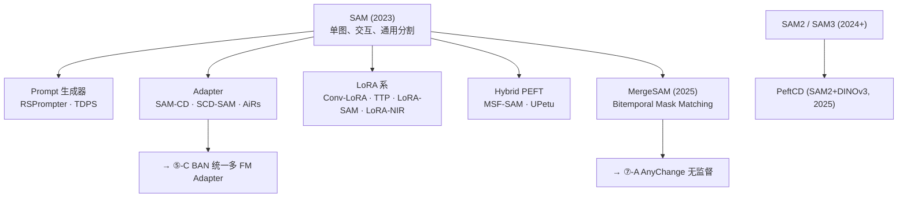

# ⑤-A · SAM 路线：冻结分割基座 → 适配 CD（RSPrompter / TTP / SAM-CD）

CD 任务类型: 二值 CD（Binary）, 建筑 CD
与 VLM 视觉思考主线关联: RS-VLM 主线 R7（视觉基础模型作为视觉塔）+ L2（SAM 接口）。
代表基座 / 骨干: 冻结 SAM ViT-B/L + 轻量适配模块
优先级: P0 · 必读
关键创新: SAM 原生是单图交互式分割（无语义、无时间），此主题解决「如何让 SAM 感知时相差异」。三种介入点：prompt 空间（RSPrompter 学 prompt generator）、activation 空间（TTP 注入 time-travelling 激活）、特征空间（SAM-CD 训练 bi-temporal adapter）。
局限 / 残差 / 催生了什么: 仍需 CD 监督；SAM 通用先验对 RS 窄域目标（轻微损毁、农田边界）不敏感；催生 BAN（多 FM 统一 adapter）与 ⑦ 零监督 SAM-Everything 路线。
年份: 2024
我的视角 / 落地价值: 三种介入点为我的 training-free 方案提供结构索引：在 prompt 空间注入语言指代，等于零监督版 TTP。SAM-CD 验证「冻结 encoder + 适配器」工程落地可行。
方法家族: Hybrid CNN-Transformer, SAM-based
机构 / 团队: Beihang LEVIR / Meta SAM 生态
模态支持: 光学 RGB
演进阶段: ⑤ 视觉基础模型驱动（2023-2024）
监督方式: 像素级全监督
训练 / 评测数据集: LEVIR-CD, S2Looking, WHU-CD
阅读状态: 待读

## 核心问题

SAM 原生只会「任意 prompt → 单图 mask」，既不感知语义类别，也不感知时间关系。整个 ⑤-A 回答同一个问题：**在不重训 SAM 主干权重的前提下，如何让它感知双时相差异、吐出变化掩膜？**

## SAM 用于 CD 的三大原生缺口

| 缺口 | 表现 | 根因 |
| --- | --- | --- |
| 无时间 | SAM 每次只处理单图，无法表达「A→B 变化」 | 预训练目标是 SA-1B 静态分割 |
| 无语义 | mask 不带类别；没有「建筑变农田」的概念 | 前景-背景二值分割预训练（Conv-LoRA 指出这阻碍了 ViT 学高层语义） |
| 域偏移 | 自然图像 → 遥感的俯视、尺度、光谱差异导致 mask 断裂 | SA-1B 以消费级 RGB 为主，俯视小目标稀少 |

## 五种介入深度（从外层提示到内层激活）

按「距离 SAM 内部权重的远近」排序，代价依次升高、性能上限依次升高：

| 介入层 | 代表 | 做了什么 | 可训练参数占比 | 需 CD 标注？ |
| --- | --- | --- | --- | --- |
| ① Prompt 生成 | **RSPrompter** (Chen 2024) | 学 prompt generator，把 CD 描述为链式思维 prompt：先判目标存在，再精分割 | 仅提示头 | 是 |
| ② 时差 prompt | **TDPS** (Fang 2024, 信号处理) | SAM backbone 插入 LoRA + 时相差异 prompt generator；把双时相差异当 SAM 稀疏提示 | LoRA 秩 ~8 | 是 |
| ③ 语义适配器 | **SCD-SAM** | 语义适配器 + 重构重叠 patch embedding + 多尺度语义融合 | Adapter ~5-10% | 是 |
| ④ 激活门控 | **TTP** (Chen 2024) | Time-Travelling Activation Gate 注入时相相关性 + LoRA + 多层级预测头 | LoRA + Gate | 是 |
| ⑤ 任务无关语义分支 | **SAM-CD** (Ding 2024) | 冻结 SAM encoder + 卷积适配器 + 任务无关语义对齐分支 | Adapter + Branch | 是 |

## 参数高效微调（PEFT）货架

SAM → CD 本质是一个 PEFT 问题。清华院士团队 CVMJ 2025 综述梳理出六大范式，⑤-A 所有工作都落在前四类：

- **Adapter Tuning** — AiRs（SCA + SRA）、SCD-SAM、Medical-SAM-Adapter 家族
- **Prompt Tuning** — RSPrompter（CoT prompt）、TDPS（时差 prompt）
- **Reparameterized / LoRA** — Conv-LoRA（瓶颈里 MoE 卷积专家，恢复 ViT 局部先验 + 高层语义）、Xue et al. LoRA-SAM（道路/水体）、LoRA-NIR（近红外）
- **Hybrid** — MSF-SAM（Adapter + LoRA）、UPetu（统一多 PEFT）

## 典型论文卡

### RSPrompter · 2024

- **一句话**：学 prompt generator 把 SAM 从「交互式」拉到「自动化」。
- **贡献**：链式思维（CoT）提示——先判断目标存在性，再触发分割，让 SAM 适配 RS 多地物交错。
- **局限**：仍需下游 CD 标注；prompt 生成器质量决定 mask 上限。

### TTP · Time Travelling Pixels（arXiv:2312.16202）

- **一句话**：在 SAM 内部注入「时间旅行激活」，让同一权重「看到」双时相相关性。
- **三件套**：① 低秩微调（LoRA）弥合自然 → 遥感域偏移；② 时空激活门（Activation Gate）植入时间建模；③ 轻量多层级预测头解码密集语义。
- **成绩**：LEVIR-CD F1 SOTA；代码开源。

### SAM-CD · arXiv:2309.01429

- **一句话**：冻结 SAM image encoder，工程最轻，刷新 LEVIR-CD / WHU-CD。
- **亮点**：卷积适配器 + 任务无关语义学习分支——在无显式语义标注时，用对比式一致性对齐双时相潜在语义。
- **意义**：证明「冻结 encoder + 小 adapter」足以把 SAM 适配到高分辨率 RS CD，是后续 [⑤-C · 统一 FM 适配器 & RS 多任务预训练（BAN / MTP）](%E2%91%A4-C%20%C2%B7%20%E7%BB%9F%E4%B8%80%20FM%20%E9%80%82%E9%85%8D%E5%99%A8%20&%20RS%20%E5%A4%9A%E4%BB%BB%E5%8A%A1%E9%A2%84%E8%AE%AD%E7%BB%83%EF%BC%88BAN%20MTP%EF%BC%89%2098e248b8649643aab1d7d3b3d85530c7.md) 的工程原型。

### TDPS · 时差提示 SAM（信号处理 40(3) 2024）

- **一句话**：把「双时相差异」直接编译为 SAM 的 prompt，省去人工点 / 框。
- **三件套**：① SAM backbone 插入低阶可微调参数（LoRA）；② 时相差异提示生成器（Temporal-Difference Prompt Generator）——双时相特征与 query embedding 联合优化得到 prompt 向量；③ 端到端训练。
- **成绩**：LEVIR-CD F1 +1.4%、WHU-CD F1 +2.5%（对比当年 SOTA）。

### Conv-LoRA · arXiv:2401.17868（ICLR 2024）

- **一句话**：在 LoRA 瓶颈里嵌 MoE 卷积专家，同时恢复 SAM 的「局部先验 + 高层语义」能力。
- **关键洞察**：SAM 的前景-背景预训练本身压制了 ViT 的语义能力；LoRA 能解压，Conv-LoRA 进一步通过多尺度卷积 + MoE 路由重建空间归纳偏置。
- **意义**：把 SAM 从「分割器」重塑为「多类语义分割器」的关键 PEFT 技术。

### SCD-SAM · 语义 CD 特化

- 语义适配器 + 重叠 patch embedding + 多尺度语义集成；SAM 在语义 CD（不仅定位，还要「从什么变成什么」）上的 PEFT 基线。

### AiRs（RS 专用 SAM 适配器）

- SCA（Spatial Context Adapter）+ SRA（Semantic Response Adapter），攻克 RS 影像「空间布局复杂 + 语义关联跨尺度」双重挑战。

### MSF-SAM / MergeSAM / PeftCD（⑤-A 的边界）

- **MSF-SAM**：Adapter + LoRA 混合，追求多模态 RS 多任务统一。
- **MergeSAM**（arXiv:2507.22675, 2025）：已经跨到 ⑦ 的影子——Bitemporal Mask Matching 做无监督 CD，不再训练任何参数。**⑤-A 的极限就是 [⑦-A · Training-Free CD 路线 A：SAM Segment-Everything + Mask 对应匹配（AnyChange）](%E2%91%A6-A%20%C2%B7%20Training-Free%20CD%20%E8%B7%AF%E7%BA%BF%20A%EF%BC%9ASAM%20Segment-Everything%20d28bfe9dd5264f118f9000d3b1a9ddb8.md) 的起点**。
- **PeftCD**（2025）：把「冻结基座 + PEFT 适配器」直接套到新一代基座（SAM2 + DINOv3），7 个 RS CD 公开数据集 SOTA——证明 PEFT + FM 范式会随基座持续吃红利。

## 技术谱系

## 共享局限（⑦ 的压力源）

1. **仍需 CD 标注**——只是从「全量训练」降为「适配器训练」，没根本摆脱像素级监督。
2. **语义先验来自 SAM 通用预训练**——对 RS 窄域（作物类型、轻微损毁、雪覆盖程度）不敏感。
3. **Mask 粒度是物体级**——难处理「模糊 / 纹理级」变化（洪水、砍伐前后的植被退化）。
4. **二值 CD 为主**——少数工作触及语义 CD（SCD-SAM / AdaptVFMs-RSCD），仍是封闭类别。
5. **工程碎片化**——每篇都有自己的 adapter 设计，换数据集 / 任务就要重调。

## 催生了什么

- 横向工程化 → [⑤-C · 统一 FM 适配器 & RS 多任务预训练（BAN / MTP）](%E2%91%A4-C%20%C2%B7%20%E7%BB%9F%E4%B8%80%20FM%20%E9%80%82%E9%85%8D%E5%99%A8%20&%20RS%20%E5%A4%9A%E4%BB%BB%E5%8A%A1%E9%A2%84%E8%AE%AD%E7%BB%83%EF%BC%88BAN%20MTP%EF%BC%89%2098e248b8649643aab1d7d3b3d85530c7.md)：不再为每个 FM 单独设计 adapter，改为「FM 无关」的 Bi-Temporal Adapter，SAM / CLIP / DINOv2 可插拔。
- 纵向根本重构 → [⑤-C · 统一 FM 适配器 & RS 多任务预训练（BAN / MTP）](%E2%91%A4-C%20%C2%B7%20%E7%BB%9F%E4%B8%80%20FM%20%E9%80%82%E9%85%8D%E5%99%A8%20&%20RS%20%E5%A4%9A%E4%BB%BB%E5%8A%A1%E9%A2%84%E8%AE%AD%E7%BB%83%EF%BC%88BAN%20MTP%EF%BC%89%2098e248b8649643aab1d7d3b3d85530c7.md)：把 CD 当一等公民放进预训练阶段。
- 彻底释放标注约束 → [⑦-A · Training-Free CD 路线 A：SAM Segment-Everything + Mask 对应匹配（AnyChange）](%E2%91%A6-A%20%C2%B7%20Training-Free%20CD%20%E8%B7%AF%E7%BA%BF%20A%EF%BC%9ASAM%20Segment-Everything%20d28bfe9dd5264f118f9000d3b1a9ddb8.md)：砍掉 adapter，走 SAM-Everything + Mask 对应匹配，training-free。

## 对我方案的意义

- **五种介入深度是结构索引**：我的 training-free 方案 = 「prompt 空间介入」的零监督版——把 TDPS 的「时间差异 prompt」替换为 CLIP 文本 / 视觉差异 prompt 注入 SAM。
- **SAM-CD 的「冻结 encoder + 任务无关分支」**是我的工程原型：保留冻结 encoder，但把分支换成 VLM caption decoder。
- **Conv-LoRA 的观察不可忽视**：SAM 的前景-背景预训练压制 ViT 语义能力 → 我方案必须从 CLIP / DINOv2 / SAM2 取语义，而非单押 SAM。
- **PeftCD 的启示**：基座会持续升级，pipeline 必须与基座解耦；我的「定位 + 语义 + 描述」三件套必须对 SAM → SAM2 → SAM3 保持鲁棒。

## 论文链接

- RSPrompter：[arxiv.org/abs/2306.16269](http://arxiv.org/abs/2306.16269)
- TTP：[arxiv.org/abs/2312.16202](http://arxiv.org/abs/2312.16202) · 项目 [kychen.me/TTP](http://kychen.me/TTP)
- SAM-CD：[arxiv.org/abs/2309.01429](http://arxiv.org/abs/2309.01429)
- TDPS：[doi.org/10.16798/j.issn.1003-0530.2024.03.001](http://doi.org/10.16798/j.issn.1003-0530.2024.03.001)
- Conv-LoRA：[arxiv.org/abs/2401.17868](http://arxiv.org/abs/2401.17868)
- MergeSAM：[arxiv.org/abs/2507.22675](http://arxiv.org/abs/2507.22675)
- PeftCD / AiRs / SCD-SAM / MSF-SAM / UPetu：见清华 CVMJ 2025 遥感微调综述 [hub.baai.ac.cn/view/50020](http://hub.baai.ac.cn/view/50020)