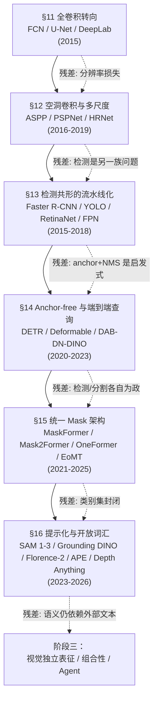
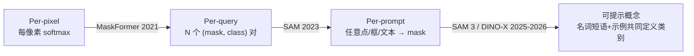

# 阶段二的结语：稠密共形的完成与开放词汇的未竟

# 阶段二的结语：稠密共形的完成与开放词汇的未竟

<aside>
🧭

阶段二（§11–§16，2014–2024）的十年，视觉深度学习完成了一次**共形的横向扩张**：从「一张图 → 一个标签」扩展到「一张图 → 稠密预测」。这一阶段的六个子章节是一条完整的逻辑链——从 **FCN 把分类器扩成稠密输出** 开始，经过 **空洞卷积补全多尺度**、**两阶段 / 一阶段检测器工程化流水线**、**DETR 把检测端到端化**、**Mask2Former 把检测/分割/全景统一到 Mask Classification**，最后到 **SAM/Grounding DINO/Florence-2/APE 把提示与开放词汇挂接进来**。

阶段结束时，视觉模型已经可以**被文本提示、被点提示、被框提示**，但仍然**无法摆脱对 CLIP / SD / 人工标注文本的外部语义依赖**——这个残差就是阶段三的出发点。

</aside>

## 一、阶段二的中心问题：共形从「点」扩到「面」

阶段一（AlexNet → ResNet → Inception）回答了一个问题：**卷积网络能不能把一张图压成一个标签**。它的成果是**判别共形**——输入一张图，输出一个类别概率分布。

阶段二的中心问题是另一个：

> 当标签不再是**一个类别**，而是**每个像素、每个物体、每个区域、每种语义的稠密结构**，网络架构、损失函数、训练范式、数据监督要如何共形地变形？
> 

这个问题看起来只是「输出维度变多」，但它撬动的是**整个范式**：

- **输出几何变了**：从 softmax 向量 → $H\times W$ 的 mask / 任意数量的 box + mask / 任意数量的开放概念
- **数据监督变了**：从 ImageNet 一亿张弱标注的类别 → COCO 数万张精标的 box+mask → SA-1B 十亿掩码（SAM）→ FLD-5B 50 亿标注（Florence-2）
- **架构分化又收敛**：FCN / U-Net / Mask R-CNN / DeepLab / DETR / Mask2Former 一路分叉，最终又在 **query-based + prompt-driven** 收束
- **监督信号分化**：从 per-pixel CE，走到 Dice+Focal+匈牙利匹配，再走到文本对比 + 点击监督 + 混合提示

每一次变形都不是偶然——它们都是**为了让网络的「输出形式」与「任务的几何/语义结构」共形**。

## 二、六个子章节的内部逻辑链

阶段二不是六个并列的主题，而是一条**环环相扣的演化链**。每一章的出现，都是为了**消解上一章的残差**。

### §11 → §12：从「能做稠密」到「做得精细」

FCN 证明了 CNN 可以被平行改造为全卷积，但**下采样丢失的分辨率**成为立即的残差。§12 的空洞卷积、PSPNet 金字塔池化、HRNet 多分辨率并行，都是为了**在不丢尺度的前提下扩大感受野**。这是稠密共形的第一次「精细化」。

### §12 → §13：从「像素」扩到「物体」

像素级分割解决了「哪里是什么」，但不回答「这是第几个物体」。§13 的 Faster R-CNN / YOLO / RetinaNet / FPN 把稠密共形推广到**实例维度**——每个物体是一个独立单位，需要框+类别+可选掩码。Mask R-CNN 在这里首次把检测和分割合流。

### §13 → §14：从「流水线」到「端到端」

两阶段检测器虽然精度高，但**anchor / NMS / ROI align** 都是人工先验，违背了深度学习「端到端学习」的哲学。DETR 用 object query + 匈牙利匹配把检测**一次性端到端化**。DAB-DETR → DN-DETR → DINO-DETR 把 query 的几何意义（先验框）补全，收敛速度从 500 epoch 降到 36 epoch，COCO 冲到 63.3 AP。

### §14 → §15：从「各自为政」到「统一 Mask Classification」

DETR 把检测端到端了，但**分割仍在用 FCN 的每像素分类范式**。MaskFormer 的洞察是：

> 语义分割、实例分割、全景分割**在本质上是同一个问题**——预测 N 个 (mask, class) 对。
> 

Mask2Former 把三个分割任务统一到**同一套 query-based 架构**，OneFormer 再加一个任务 token 让同一套权重跑三个任务，EoMT 把 query 直接嵌进 ViT encoder 证明「encoder 就是 decoder」。

### §15 → §16：从「封闭类别集」到「任意提示」

Mask2Former 统一了分割，但 `class` 头仍然是**封闭的** $K$ **维 softmax**——训练时见过的类别才能预测。§16 把这层天花板捅破：

- **SAM** 用点/框/掩码做视觉 prompt，类别头被彻底移除（只输出通用 mask）
- **Grounding DINO / YOLO-World / APE** 用文本做 prompt，class 头变成「文本嵌入 · 视觉嵌入」的点积
- **Florence-2** 直接把所有任务序列化成 `<loc_123>` 这样的文本 token，用一个 seq2seq 通吃
- **Depth Anything** 把 prompt 范式外推到**连续回归**（深度图）

到 §16 末尾，视觉模型已经**不挑任务、不挑类别、不挑模态的提示**——但仍挑**外部语义源**。

## 三、三条结构性主线（贯穿六章）

如果把六章当作时间线，就看不出模式。真正贯穿阶段二的是**三条正交的主线**：

### 主线 A：表征骨干的三次代际更替

| 代际 | 骨干范式 | 代表作 | 共形贡献 | CNN 时代 | ResNet + FPN + 空洞卷积 | Faster R-CNN, Mask R-CNN, DeepLab v3+ | 把「判别共形」的骨干复用到稠密任务，感受野通过空洞和金字塔补偿 |
| --- | --- | --- | --- | --- | --- | --- | --- |
| Transformer 过渡 | ViT / Swin / PVT + 卷积 neck | DETR, Swin-Mask R-CNN, SegFormer | 自注意力取代 NMS 和 anchor 的「全局选择」角色 | 自监督基础模型 | DINOv2 / SAM-ViT / CLIP-ViT | Mask2Former (Swin-L)、SAM、Grounding DINO | 骨干不再从 ImageNet 1000 类监督学起，而从 LVD-142M/SA-1B/LAION 无监督或弱监督学起 |

**关键观察**：阶段二末尾 SAM 的 ViT-H、DINOv2 的 ViT-g、CLIP 的 ViT-L 开始成为**可插拔骨干**——检测/分割/深度估计全部是这些基础模型的下游头。这预示阶段三的核心主题：**视觉基础模型本身**，而不再是任务专用架构。

### 主线 B：接口的三次范式跃迁（Per-pixel → Per-query → Per-prompt）

阶段二最深刻的变化，不是骨干，而是**模型与任务之间的接口**：

- **Per-pixel**（FCN/DeepLab/SegFormer）：网络输出 $H\times W\times K$ 的概率体，每个像素独立决策。天然适合语义分割，但**无法区分同类的多个实例**
- **Per-query**（DETR/Mask2Former/OneFormer/EoMT）：N 个 object query，每个 query 负责一个**实体单位**（物体或 stuff 区域），输出 (mask, class)。统一了检测/分割/全景
- **Per-prompt**（SAM/Grounding DINO/Florence-2）：query 不再是**固定数量的可学习向量**，而是**用户/文本在推理时动态提供**的点、框、短语。类别集变成无穷
- **可提示概念**（SAM 3 / DINO-X / T-Rex2）：prompt 本身从「定位指令」升级为「**概念定义**」——「所有这种东西」而不是「这里的东西」

**本质变化**：接口从「**架构决定输出空间**」变成「**用户决定输出空间**」。这是从「模型是封闭函数」到「模型是可参数化服务」的**本体论转变**。

### 主线 C：监督的三次深化（人工标签 → 伪标签 → 语言/prompt 对齐）

阶段二的数据量扩张不是线性的，而是**监督密度本身发生变形**：

| 时期 | 典型数据 | 监督信号 | 特征 | 2014–2018 | PASCAL VOC, COCO (<12 万图) | 精标 box / mask | 昂贵、慢、类别封闭；每一个像素都被人看过 |
| --- | --- | --- | --- | --- | --- | --- | --- |
| 2018–2022 | LVIS, Objects365, OpenImages (~200 万图) | 半密集 box + 稀疏尾类 | 长尾；类别扩到 1000+ 但仍封闭 | 2021–2023 | LAION / CC-3B / WebLI (数十亿 img-text) | 弱监督 image-text 对齐 | CLIP 范式；类别集变无穷但粒度粗（全图级） |
| 2023–2024 | SA-1B（10 亿 mask）、FLD-5B（50 亿标注）、62M 伪深度 | Model-in-the-loop 自动标注 | **数据引擎**：用前一代模型自动标，人只审 quality | 2024–2026 | SAM 3 / DINO-X / T-Rex2 的 concept 数据 | **概念级 prompt + 反馈** | 监督从 box/mask 上升到「这个概念长什么样」 |

**关键转折**：SAM 开启的「**Data Engine**」——用模型自己产生下一代模型的训练数据——是阶段二的**技术奇点**。这个 loop 的存在，使得视觉数据第一次可以像文本数据一样「指数级」增长。Depth Anything 用 62M 伪深度 + DINOv2 蒸馏，把这个 loop 复制到了连续回归。

## 四、阶段二解决了什么（Before vs After）

| 维度 | 阶段二开始（2014 年） | 阶段二结束（2024–2026 年） |
| --- | --- | --- |
| 任务统一度 | 检测/分割/全景各有独立 SOTA 模型 | Mask2Former / OneFormer / Florence-2 / APE 单模型通吃 |
| 类别集开放度 | 封闭 80/1000 类 | 开放词汇（任意名词短语 + 示例） |
| 训练数据规模 | COCO ~12 万 | SA-1B 十亿 / FLD-5B 50 亿 |
| 零样本稠密回归 | 不存在 | Depth Anything v2 跨域 SOTA |

**最重要的两个可度量胜利**：

1. COCO detection AP：DETR 42.0 → DINO-DETR **63.3**（三年翻了 1.5 倍，同时端到端）
2. 开放词汇 LVIS AP：YOLO-World **35.4**（实时）/ APE **64.8**（精度）—— 从「不可能」到「可用」

## 五、阶段二的四个残差（→ 阶段三的出发点）

阶段二末尾并非胜利凯旋，恰恰相反——它留下了**四个结构性残差**，每一个都指向阶段三的一个方向。

### 残差 ①：语义外包，视觉没有自己的概念空间

这是阶段二最**根本**的残差。

观察 §16 的十三条目：**SAM / SAM 2 / SAM 3 / Grounding DINO / YOLO-World / APE / Florence-2 / ODISE / CAT-Seg / FC-CLIP / DINO-X / T-Rex2 / Depth Anything**——没有一个能**不依赖外部语言/文本监督**完成任意概念的开集识别。

- Grounding DINO / YOLO-World：直接把 CLIP 文本编码器塞进检测头
- ODISE：语义来自 Stable Diffusion 的内部特征（而 SD 的语义是 CLIP 喂的）
- CAT-Seg / FC-CLIP：直接冻结 CLIP，视觉侧只负责把 CLIP 的相似度图「空间化」
- SAM 1 / 2：干脆不做语义，只做**类别无关的分割**
- Florence-2：用文本 token（`<loc_*>`）把所有任务**降维**到文本序列

**共同结构**：视觉模型**没有自己的「概念」**，所有开集识别本质上都是「**用文本/语言的概念，去筛选视觉的定位候选**」。

> 视觉模型学的是「**哪里**」，语义靠语言模型外挂。
> 

这和 NLP 的演化完全不对称。NLP 模型从 word2vec → BERT → GPT 一路在**构建自己的语义空间**。视觉没有这样的路径——CLIP 的「视觉空间」本质上是**被语言拉对齐**的投影，不是独立生长的。

**阶段三的第一个关键方向**：**视觉独立语义表征的可能性**——JEPA / DINOv3 / V-JEPA 2 / Fluid 的尝试。

### 残差 ②：Scaling 回报曲线形态不同

SAM 1 → SAM 2 → SAM 3 → SAM 3.1 ≈ DINOv1 → DINOv2 → DINOv3 的数据量增长：

- DINOv1 → v2：142 倍数据，ADE20K mIoU 从 44 提到 53（+9）
- DINOv2 → v3：17 倍数据（1.4B → 1.69B+493M SAT），ADE20K mIoU 从 53 提到 60.7（+7.7）
- SAM 1 → SAM 2：~10 倍数据，mIoU 基本持平（视频扩展反而是核心升级）

同期的 NLP：

- GPT-2 → GPT-3：117M → 175B，in-context learning **涌现**
- GPT-3 → GPT-4：~20 倍计算，推理能力再跃迁

**视觉的 scaling 回报是对数饱和型，NLP 是陡峭 power law 型**。这不是监督密度的问题（SA-1B 的密度远高于 CC-3B），而是：

- 像素级信号大量是**冗余的**（相邻像素几乎完全相关）
- 视觉任务的**天花板**本来就低（COCO detection 再怎么提也不会跨越物种）
- 视觉没有**组合性的递归结构**（语言的 token 可以无限组合，像素的组合在纹理层就饱和）

**阶段三的第二个方向**：**找新的视觉任务天花板**——不是继续在 COCO/ADE20K 上堆，而是推理（VQA）、Agent 决策、3D 理解、时序因果。

### 残差 ③：VLM「看不清」问题

阶段二末尾（2023–2024），视觉模型开始被当作 VLM 的 encoder 使用（LLaVA / CogVLM / GPT-4V / Gemini Pro）。但 MMVP、MMStar、BLINK 等 benchmark 揭露了一个尴尬现象：

- CLIP 视觉对的「**盲对**（blind pairs）」——人看一眼知道不同，CLIP embedding 的相似度 >0.95
- GPT-4V 在 MMVP 上只拿 38.7%，人类 95%
- 62% 的 VLM 错误源于**视觉识别层面**，而非语言推理层面

**本质诊断**：阶段二的视觉骨干（SAM-ViT / CLIP-ViT / DINOv2）在**定位**上很强，在**细粒度区分**上非常弱。这不是分辨率问题（给更高分辨率也不解决），而是**训练目标不匹配**——CLIP 学的是「图-文配对」，不是「图-图区分」。

**阶段三的第三个方向**：**感知粒度的修复**——Visual CoT、TTSP（Test-Time Scaling Policy）、MVoT、RADIO（多教师蒸馏）、Fluid（无 vocabulary 视觉 scaling）。

### 残差 ④：query 的本质仍未解开

DETR 的 100 个 object query → Mask2Former 的 200 个 mask query → SAM 的 prompt token → APE 的统一 query → Florence-2 的 `<loc_*>` token：

**query 在不断被包装和泛化，但其内部几何从未被真正理解**。

我们知道：

- query 是可学习的 N 个 d 维向量
- query 通过 cross-attention 从图像特征中「拉取」信息
- 训练后 query 会分化出空间偏好（DAB-DETR 证明）、尺寸偏好、类别偏好（Mask2Former 消融）

但我们**不知道**：

- query 的流形结构是什么（是分立聚簇还是连续流形？）
- N 个 query 之间的相互作用是否有等价的闭式描述
- query 的「数量」应该由什么决定（100 够不够？1000 会不会更好？）
- prompt token（SAM）、seq token（Florence-2）、learnable query（Mask2Former）是否在学同一个子流形

这是阶段二**最深的黑箱**——它的所有成功都依赖 query 机制，但 query 机制本身没有被理解。

**阶段三的第四个方向**：**query/prompt 几何的理论化**——它可能是「视觉的 token」（语言的 token 对应于词元，视觉的 token 对应于 query？），也可能完全不同。

## 六、阶段二的「一条公理」

回顾六章的全部胜利，可以用一条公理性陈述概括：

<aside>
⚖️

**阶段二的公理**：任何稠密视觉任务，最终都可以被表达为「一组 query 在一组特征上做 cross-attention，输出 (位置, 语义)  对」。差别只在：

- **特征**是 CNN/ViT/SAM-encoder 产生的
- **query** 是固定数量的可学习向量、还是用户提供的 prompt、还是文本 token 展开的序列
- **位置**是 box/mask/点/深度/关键点
- **语义**是封闭类别索引、还是 CLIP 文本嵌入、还是任意名词短语的嵌入

这四个槽位任意组合，穷尽了阶段二的全部模型。

</aside>

这条公理**解释**了为什么 DETR、Mask2Former、SAM、Grounding DINO、Florence-2、APE 看起来差别很大，实际上只是**四个槽位的不同填充**；也**预测**了阶段二内部不会再出现本质上的新东西——所有「新模型」只是在这四个槽位里重新排列组合。

真正的下一次跃迁，只能来自**打破这条公理**本身——也就是阶段三。

## 七、通向阶段三的三道门

阶段三（Post-2024）的起点有三道可能的门，对应前述三条残差的解法方向：

### 门 A：视觉独立 scaling（JEPA / DINOv3 / Fluid / V-JEPA 2）

试图**让视觉模型不依赖语言也能学到语义结构**。JEPA 系列用「在嵌入空间预测」代替 CLIP 的「图-文对齐」，DINOv3 的 Gram Anchoring 保护局部几何，Fluid 证明「无词汇视觉 scaling」可以比 CLIP 学得更好。

**核心赌注**：视觉有自己的「**视觉语义**」，只是之前没被正确的目标函数激活。

### 门 B：测试时视觉回看（Visual CoT / TTSP / MVoT）

接受「一次性前向 pass 看不清」这个事实，改用**推理时多次回看**来补偿。Visual CoT 让 VLM 在推理中主动放大图像区域，TTSP 让模型自主决定看几次、看哪里，MVoT 把「视觉思考」显式化为 token 序列。

**核心赌注**：视觉推理不是「一眼看穿」，而是「边看边想」——视觉模型需要一个**动作空间**（放大/裁剪/对比/标注）。

### 门 C：聚合蒸馏（RADIO / C-RADIOv4 / MoF）

不赌单个范式能自我救赎，而是**把 CLIP、DINOv2、SAM、MAE 的所有互补知识蒸进一个统一 backbone**。

**核心赌注**：没有「最好的一个 backbone」，只有「所有 backbone 的加权和」。

